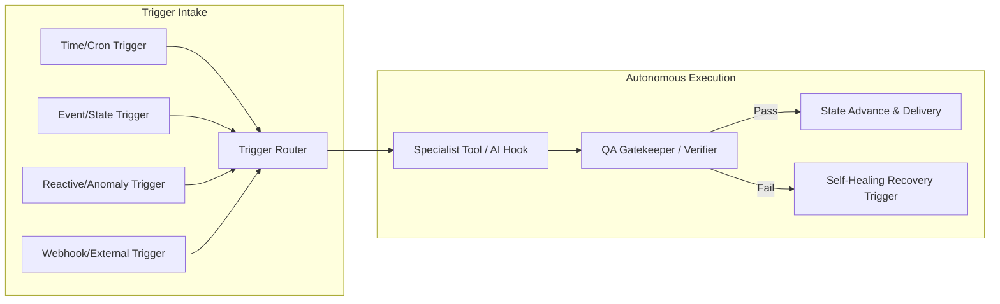

# AI Hooks, Tools & Automation Trigger Audit Skill

Use this skill to audit, diagnose, and benchmark the complete trigger, tooling, and AI hook infrastructure of an autonomous system. It maps all automated pathways, determines what is executing in production vs. sitting dormant in dead code, and provides a clear blueprint to achieve **100% lights-out autonomy**.

---

## 🧭 Core Philosophy: The Autonomous Loop Contract

An autonomous system is only as automated as its weakest trigger. If any step requires manual operator intervention, human copy-pasting, or unmonitored polling, the system is **semi-automated**, not autonomous.



### The 4 Trigger Health States

Every trigger in the codebase falls into one of four states:

| Status | Definition | Risk Level |
| :--- | :--- | :---: |
| 🟢 **Active / Working** | Trigger is wired to an active scheduler, webhook, or state machine event, tested, and fires reliably. | None |
| 🔴 **Broken / Degraded** | Trigger is wired but fails due to unhandled exceptions, missing headers/CSRF, bad state checks, or unhandled 3rd-party errors. | High |
| 🟡 **Dormant / Orphaned** | Trigger function/schema exists in the codebase (`winback_stage`, `drift_alert`, `upsell_sent`), but is never called by a running loop or thread. | Medium |
| ⚪ **Missing Gap** | Necessary trigger does not exist yet (e.g. automatic retry on WAF 403, Slack alert on builder block, post-delivery referral hook). | High |

---

## 🔍 Audit Taxonomy: What to Inspect

When auditing an automated codebase, inspect across **5 Core Trigger Categories**:

### 1. Time & Schedule Triggers (Cron / Background Workers)
* **Delivery Batch Triggers**: Are morning deliveries (e.g. 6:00 AM – 8:00 AM) scheduled on an active loop or relying on manual sync?
* **Pre-Flight Retainer Checks**: Does the system verify DOM selectors and target health *before* delivery time?
* **Lifecycle Win-Back Triggers**: Are inactive/abandoned prospects followed up automatically on Day 3, Day 7, and Day 14?
* **Operator Morning Briefings**: Does the system compile and email daily pipeline summaries to admins without manual queries?
* **Heartbeat & Liveness Pings**: Are long-running builds emitting periodic status events?

### 2. Event-Driven & State Machine Triggers
* **Discovery ➔ Intake**: Does public registry verification automatically generate prospect sandboxes?
* **Checkout ➔ Build**: Does payment capture (PayPal/Stripe) automatically spin up the autonomous builder swarm?
* **Build ➔ QA Gate**: Does code generation automatically hand off to the QA tester with zero human button-pressing?
* **QA Pass ➔ Escrow Preview**: Does high QA score (>=95%) automatically notify customer and unlock final milestone checkout?
* **Final Payment ➔ Provisioning**: Does balance capture automatically transition to live scheduled retainer?

### 3. Reactive & Self-Healing Triggers (Error Handling Loops)
* **Anti-Bot / WAF Blocks (403 / Cloudflare)**: Does the crawler trigger proxy rotation, stealth mode, or admin dispatch instead of freezing?
* **Schema Drift & Selector Breakage**: Does the drift monitor detect table changes and trigger autonomous selector repair?
* **Zero-Row Extraction**: Does a blank scrape trigger fallback query strategies or alert the engineering queue?
* **Webhook Retry Backoff**: Do failed customer webhook deliveries retry with exponential backoff before dead-lettering?

### 4. AI Tool & Specialist Agent Hooks
* **Specialist Tool Dispatch**: Are specialized tools (DOM Pruner, Playwright Runner, WAF Prober, Code Synthesizer, QA Gatekeeper) invoked dynamically or hardcoded?
* **LLM Generation Hooks**: Are cold outreach pitches, lifecycle emails, and conversational intake responses triggered contextually with robust fallbacks if the LLM provider is offline?
* **Context Pruning**: Do tools clean DOMs/dockets before sending to LLMs to prevent token explosion?

### 5. Quota & Growth Triggers
* **Field / Volume Caps**: Does selecting >15 fields or syncing >500 rows trigger in-app upgrade banners?
* **Referral Ask Trigger**: Does the first successful delivery trigger the colleague referral discount sequence?
* **Buyout Offer Trigger**: Does reaching Month 3 of subscription trigger the Perpetual Code Buyout offer?

---

## 🛠️ How to Execute the Audit (Step-by-Step)

Follow this structured 5-step methodology:

### Step 1: Discover All Triggers & Background Threads
Run a ripgrep scan across the repository for trigger definitions:
```bash
# Schedulers, background threads, and loops
grep -rn "threading.Thread\|asyncio.create_task\|schedule\|cron\|sleep\|setInterval" agents/

# Webhooks and external event endpoints
grep -rn "@router.post\|@app.post\|/webhook\|/events\|/callback" agents/

# Domain state transitions and payment events
grep -rn "transition(\|record_payment(\|PaymentEvent" agents/
```

### Step 2: Test & Verify Trigger Wiring
For every discovered trigger, trace:
1. **Source**: What produces the event? (HTTP request, timer, database poll, worker error)
2. **Transport**: How is it transmitted? (Direct function call, background thread, WebSocket, Redis/SQLite queue)
3. **Execution**: Does the receiver have proper error handling, or will an unhandled exception crash the trigger thread?
4. **Idempotency**: What happens if the trigger fires twice for the same entity?

### Step 3: Identify Dormant & Orphaned Logic
Look for:
- Database columns / dataclass attributes that are defined but never read or updated by background tasks.
- Email templates or webhook handlers defined in helper modules that have no callers.
- UI buttons or endpoints that return mock data without invoking backend execution engines.

### Step 4: Map the End-to-End Automation Pipeline
Construct a Mermaid state machine and sequence diagram detailing the complete autonomous loop from lead generation to continuous daily delivery.

### Step 5: Produce the Scored Audit Report
Generate a standardized audit report in the conversation artifacts directory following the specification below.

---

## 📋 Standard Output Format: Trigger Audit Report

The audit output must follow this clean, structured markdown template:

```markdown
# AI Hooks, Tools & Automation Trigger Audit Report

**Audit Date**: [Date]  
**Audited System**: [Project Name]  
**Autonomy Score**: [X.X / 10]  
**Evaluator**: LeadOps AI Trigger & Tool Audit Framework  

---

## Executive Summary
[2-3 paragraph summary of automation health, identifying the biggest bottlenecks and manual dependencies preventing 100% lights-out operation.]

---

## Trigger Health Matrix

| Trigger Category | Trigger Name | Source / Cadence | Target Action | Status | Issue / Gap |
| :--- | :--- | :--- | :--- | :---: | :--- |
| **Schedule** | Daily Delivery Sync | 06:00 AM UTC | Sheets / Webhook Append | 🟢 Active | Verified |
| **Schedule** | Win-Back Sequence | Inactivity > 3d | Lifecycle Email Dispatch | 🟢 Active | Verified |
| **Event** | PayPal Deposit Capture | Webhook / API | Launch Dev Swarm | 🟢 Active | Verified |
| **Reactive** | WAF Block Handler | 403 Response | Proxy Rotation / Alert | 🔴 Broken | Needs recovery banner |
| **Growth** | Referral Trigger | Delivery Count >= 1 | Referral Email / Credit | 🟡 Dormant | Template exists, no hook |
| **Tool** | DOM Pruner | Specialist Build | Clean HTML for LLM | 🟢 Active | Verified |

---

## Pipeline Automation Flow Diagram
[Mermaid diagram illustrating trigger flows, automated steps, failure branches, and manual bottlenecks]

---

## Deep-Dive Analysis: The 4 Critical Dimensions

### 1. Active & Working Automations (🟢)
[Detailed breakdown of what is running seamlessly]

### 2. Broken & Degraded Triggers (🔴)
[Root-cause analysis of triggers that fail or throw exceptions]

### 3. Dormant & Orphaned Infrastructure (🟡)
[Unused templates, un-polled database columns, and un-hooked features]

### 4. Missing Triggers Needed for 100% Autonomy (⚪)
[Concrete list of triggers that must be added to eliminate manual operator steps]

---

## Prioritized Implementation Action Plan

| Priority | Task ID | Trigger to Implement / Fix | Affected Files | Expected Autonomy Impact |
| :---: | :---: | :--- | :--- | :--- |
| 🔴 **P1** | TRIG-01 | [Critical Fix] | `agents/file.py` | Eliminates operator unblocking |
| 🟠 **P2** | TRIG-02 | [High Priority Trigger] | `agents/file.py` | Automates lifecycle step |
| 🟡 **P3** | TRIG-03 | [Growth / Optimization] | `agents/file.py` | Increases referral conversion |

---

## Verification & Test Plan
[Commands and test scripts to validate all triggers in staging/local environments]
```

---

## ⚡ Self-Correction & Quality Checklist

Before finalizing any audit report, verify:
- [ ] Have all background threads in `run_server.py` or worker files been checked for unhandled crash vectors?
- [ ] Are state transitions strictly compliant with the system's domain state machine?
- [ ] Are third-party API dependencies (OAuth tokens, API keys, SMTP credentials) wrapped with graceful fallbacks?
- [ ] Does every failure state have a corresponding notification or auto-recovery trigger?
- [ ] Is every recommendation backed by concrete file paths and code references?
