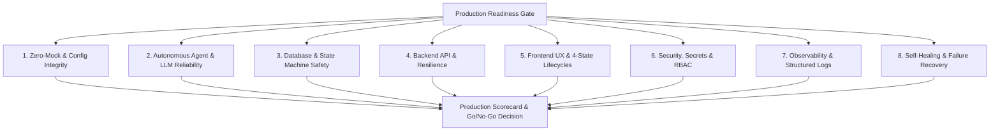
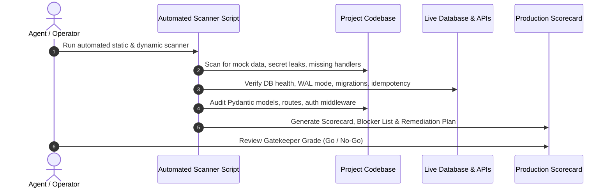

# Automated Production-Ready Check Skill

Use this skill to audit, diagnose, score, and certify whether a full-stack codebase, autonomous agent pipeline, or backend service is **100% PRODUCTION READY** for live deployment.

This skill acts as an unyielding automated **Quality & Production Gatekeeper**, ensuring that systems deployed to real users and enterprise clients are robust, secure, resilient, fully automated, and completely free of hardcoded shortcuts or fragile mock data.

---

## 🏛️ The 8 Pillars of Production Readiness

A system is only certified **Production Ready** when it satisfies all eight fundamental pillars:



| Pillar | Focus Area | Mandatory Requirement | Failure Severity |
| :--- | :--- | :--- | :---: |
| **1. Zero-Mock & Config** | Real Data & Dynamic Config | 0% fake mock data in prod; 100% env-driven settings; full `.env.example` parity. | **CRITICAL (Blocker)** |
| **2. AI Agents & LLMs** | Tooling & Autonomous Swarms | Multi-provider LLM fallbacks; token budget caps; context pruning; schema validation. | **HIGH (Blocker)** |
| **3. Database & State** | Persistence & Concurrency | Atomic state transitions; WAL mode/pooling; idempotency keys; zero unindexed queries. | **CRITICAL (Blocker)** |
| **4. Backend API & Routes** | FastAPI/HTTP Layer | Structured error handlers; route validation; rate limits; CORS & health probes (`/healthz`). | **HIGH** |
| **5. Frontend & UI Hardening** | Client Portal & UX | 4-state lifecycle (Loading/Error/Empty/Success); token CSS; zero unhandled promise rejections. | **MEDIUM / HIGH** |
| **6. Security & Auth** | RBAC, Webhooks & Secrets | 0 plaintext secrets in repo; signed webhook verifications (Stripe/PayPal/Clerk); CSRF/XSS sanitization. | **CRITICAL (Blocker)** |
| **7. Observability** | Logs, Traces & Metrics | Structured JSON logging; context-bound request IDs; health pingers; zero silent `except: pass`. | **HIGH** |
| **8. Self-Healing & Ops** | Fault Tolerance & Recovery | Auto-retry with exponential backoff; dead-letter queues; WAF bypass/selector self-healing. | **HIGH** |

---

## 🚦 Scoring Matrix & Production Gatekeeper Rules

The production audit calculates a weighted score (0–100) across all 8 pillars:

```
Score = ∑ (Pillar Score × Pillar Weight)
```

| Total Score | Grade | Status | Deployment Verdict | Action Required |
| :---: | :---: | :---: | :---: | :--- |
| **95 – 100** | **A+** | 🟢 **Certified Production Ready** | **APPROVED (GO)** | Proceed to live production rollout with confidence. |
| **85 – 94** | **A** | 🟢 **Production Capable** | **CONDITIONAL GO** | Deploy permitted; non-critical warnings scheduled for next sprint. |
| **70 – 84** | **B / C** | 🟡 **Staging Only** | **NO-GO (BLOCKED)** | Must resolve all high-severity findings before production cutover. |
| **< 70** | **F** | 🔴 **Unsafe / Degraded** | **STRICT NO-GO** | Critical blockers present. Immediate remediation required. |

### ⛔ Instant Blocker Conditions (Automatic NO-GO)
Regardless of total score, **ANY** of the following conditions triggers an immediate **NO-GO**:
1. 🛑 Any hardcoded secret, API key, private token, or password found in source code.
2. 🛑 Hardcoded mock arrays/dictionaries masquerading as live production data.
3. 🛑 Unhandled catch-all `except: pass` in mission-critical payment, ingestion, or state transition paths.
4. 🛑 Missing webhook signature verification for billing/payment processors.
5. 🛑 Unhandled database connection exhaustion / absence of connection pooling or WAL mode.
6. 🛑 Broken `/healthz` or `/readyz` probes.

---

## 🔍 Detailed Pillar Audit Taxonomy

### Pillar 1: Zero-Mock & Dynamic Configuration
* **No Mock Data in Production Paths**: Ensure all data consumed by endpoints, dashboards, and agent pipelines originates from live APIs, databases, or validated webhooks.
* **Environment Variable Resolution**: Validate that all database URLs, API base endpoints, LLM API keys, ports, and CORS origins are loaded via `os.getenv` / `pydantic-settings` with validated types and fallback defaults where appropriate.
* **`.env.example` Completeness**: Verify every required environment variable is documented in `.env.example` without leaking sensitive secrets.

### Pillar 2: Autonomous Agent Swarm & LLM Infrastructure
* **LLM Resilience & Fallback Providers**: When primary LLM providers (e.g. Gemini, OpenAI, Claude) experience rate limits (429) or service outages (503), does the system gracefully fail over to secondary providers or queue the task?
* **Token Budget & Context Pruning**: Are DOM dockets, raw scrapes, and large text payloads trimmed and sanitized before feeding into LLM context windows to prevent token overflows and runaway costs?
* **Deterministic Schema Validation**: Are LLM outputs parsed using strict Pydantic models or JSON schemas with auto-repair retry prompts on parse failures?
* **Execution Timeout & Killswitches**: Are autonomous agent execution loops bound to maximum iteration limits and execution timeouts to prevent infinite loops?

### Pillar 3: Database Integrity & State Machine Safety
* **State Transition Atomicity**: Are domain state transitions (e.g. `PENDING` ➔ `BUILDING` ➔ `QA_VERIFIED` ➔ `ACTIVE_RETAINER`) enforced by state machines with guards against invalid illegal transitions?
* **Concurrency & Locking**: Are concurrent writes protected with database transactions (`BEGIN IMMEDIATE` / row-level locks / optimistic concurrency versions)?
* **Connection Pooling & WAL Mode**: In SQLite, is Write-Ahead Logging (`PRAGMA journal_mode=WAL;`) and `PRAGMA busy_timeout=5000;` enabled? In Postgres, is connection pooling (e.g. asyncpg pool, SQLAlchemy pool) tuned for production workloads?
* **Idempotency**: Are payment callbacks, webhook ingestions, and background dispatchers idempotent via unique transaction IDs or idempotency keys?

### Pillar 4: Backend API & Service Resilience
* **Route Validation**: Are all request payloads, query params, and route parameters validated via Pydantic schemas?
* **Global Error Middleware**: Are all unhandled exceptions caught by a centralized FastAPI exception handler returning standardized JSON errors (`{ "error": "...", "code": 500, "request_id": "..." }`) rather than leaking stack traces to clients?
* **CORS & Security Headers**: Is CORS explicitly configured for production client origins (no wildcard `*` with credentials in production)?
* **Liveness & Readiness Probes**: Do `/healthz` and `/readyz` endpoints perform genuine checks (verifying DB connectivity, queue availability, disk space) rather than returning a static `{"status": "ok"}`?

### Pillar 5: Frontend & UX Production Hardening
* **4-State UI Lifecycle**: Every data-fetching UI widget must implement all four lifecycle states:
  1. `Loading State`: Sleek skeleton loader or spinner.
  2. `Error State`: Friendly error message with an interactive "Retry" button.
  3. `Empty State`: Informative illustration/banner with a clear Call-to-Action.
  4. `Success State`: High-contrast, dynamic, data-driven interface.
* **Design Token System**: Ensure UI uses CSS Custom Properties (`--bg-primary`, `--text-primary`, `--border-subtle`) instead of ad-hoc arbitrary styles.
* **Network Interceptors & Auth Expiry**: Does frontend fetch client automatically handle 401/403 responses by refreshing tokens or routing to authentication?

### Pillar 6: Security, Secrets & Access Control
* **Secrets Sanitization**: Verify zero API keys (`sk_...`, `AIza...`, `ghp_...`), private keys, or passwords committed to Git.
* **Webhook Signature Verification**: Verify all external webhooks (Stripe, PayPal, Clerk, Resend) validate HMAC-SHA256 signatures before processing payloads.
* **RBAC & Endpoint Authorization**: Verify protected routes validate user session/JWT claims, organization ID tenancy, and user roles (Admin vs. Operator vs. Client).
* **Input Sanitization & Injection Defense**: Prevent SQL injection via parameterized ORM/queries; sanitize HTML user inputs to prevent XSS.

### Pillar 7: Observability, Metrics & Structured Logging
* **Structured Logging**: Are logs emitted in machine-readable JSON or standard structured format with timestamp, log level, module, function, and trace ID?
* **No Silent Suppressions**: Eliminate all `except Exception: pass` anti-patterns. Every caught exception must be logged at `WARNING` or `ERROR` level with contextual metadata.
* **Performance & Latency Tracking**: Are slow database queries (>500ms) and external API latencies tracked and warned?

### Pillar 8: Self-Healing & Fault Tolerance
* **Exponential Backoff Retries**: Do external network calls (web scrapers, third-party APIs, webhooks) implement jittered exponential backoff retries?
* **Dead Letter Queues**: Do permanently failed tasks get routed to a dead-letter table or administrative alerting queue rather than vanishing?
* **Self-Healing Automation**: Does the system possess reactive recovery logic (e.g. rotating proxies on 403 blocks, attempting fallback selector strategies on DOM drift)?

---

## 🛠️ Automated Audit Execution Workflow

Follow this 6-step procedure when conducting a Production Readiness Check:



### Step 1: Run the Automated Production Readiness Scanner
Execute the comprehensive production readiness script:
```bash
python .agents/skills/automated-production-ready-check/scripts/check_production_readiness.py --workspace . --output audit_production_report.md
```

### Step 2: Perform Ripgrep Static Verification
Verify critical checks with targeted ripgrep searches:

```bash
# Check 1: Detect hardcoded fake/mock arrays in production code (exclude tests)
grep -rn --exclude-dir=tests --exclude-dir=tests_e2e "mock_data\|fake_\|dummy_\|SAMPLE_DATA\|TEST_DATA" .

# Check 2: Detect silent exception suppressions (except: pass)
grep -rn "except.*:\s*pass" .

# Check 3: Check for raw exposed API keys and hardcoded secrets
grep -rn --exclude-dir=.git --exclude="*.env*" "AIza\|sk_live_\|sk_test_\|ghp_\|Bearer [a-zA-Z0-9_\-\.]{20,}" .

# Check 4: Check for missing webhook signature verifications
grep -rn "def.*webhook\|@.*\.post.*webhook" .

# Check 5: Check database connection pragmas and pooling
grep -rn "journal_mode\|busy_timeout\|pool_size\|create_engine" .
```

### Step 3: Inspect Backend API & Route Coverage
* Verify every FastAPI route has explicit response models (`response_model=...`) and handles standard HTTP status codes (200, 400, 401, 403, 404, 422, 500).
* Verify presence of global CORS and rate limiting middleware.

### Step 4: Validate Frontend Resilience
* Review UI JavaScript/TypeScript files for error boundaries, skeleton loaders, and live data binding.
* Verify zero hardcoded `http://localhost:...` strings in frontend bundles; ensure dynamic base URL discovery.

### Step 5: Calculate Production Readiness Score
Tally points across each category according to the scoring template.

### Step 6: Generate Formal Production Readiness Report
Produce a standardized markdown report using the template below.

---

## 📋 Production Readiness Report Template

When completing the check, format the output as follows:

```markdown
# 🚀 Production Readiness Gatekeeper Audit Report

**Date:** [YYYY-MM-DD]  
**Project / Service:** [Project Name]  
**Auditor / Agent:** [Agent Name]  
**Final Production Score:** [X / 100]  
**Gatekeeper Status:** [🟢 APPROVED (GO) | 🟡 CONDITIONAL GO | 🔴 STRICT NO-GO]

---

## 📊 Score Breakdown by Pillar

| # | Pillar | Weight | Score (0-100) | Weighted Points | Status |
|---|---|:---:|:---:|:---:|:---:|
| 1 | **Zero-Mock & Config Integrity** | 20% | [Score] | [Weighted] | [🟢/🟡/🔴] |
| 2 | **Autonomous Agent & LLM Reliability** | 15% | [Score] | [Weighted] | [🟢/🟡/🔴] |
| 3 | **Database & State Machine Safety** | 15% | [Score] | [Weighted] | [🟢/🟡/🔴] |
| 4 | **Backend API & Route Resilience** | 10% | [Score] | [Weighted] | [🟢/🟡/🔴] |
| 5 | **Frontend UX & 4-State Lifecycles** | 10% | [Score] | [Weighted] | [🟢/🟡/🔴] |
| 6 | **Security, Secrets & RBAC** | 15% | [Score] | [Weighted] | [🟢/🟡/🔴] |
| 7 | **Observability & Structured Logs** | 7.5% | [Score] | [Weighted] | [🟢/🟡/🔴] |
| 8 | **Self-Healing & Fault Tolerance** | 7.5% | [Score] | [Weighted] | [🟢/🟡/🔴] |
| **TOTAL** | | **100%** | | **[Total Score] / 100** | **[Grade]** |

---

## ⛔ Critical Blockers (Must fix before deployment)
1. **[Pillar] Blocker Description**: [Details, affected files, line numbers, and impact]

---

## ⚠️ High & Medium Warnings (Fix before next release)
1. **[Pillar] Warning Description**: [Details and recommendation]

---

## 🛠️ Prioritized Remediation Action Plan

| Priority | Issue / Blocker | Target File(s) | Prescribed Fix |
| :---: | :--- | :--- | :--- |
| **P0** | [Issue Summary] | `[path/to/file.py](file:///path/to/file.py#L10)` | [Exact code change description] |
| **P1** | [Issue Summary] | `[path/to/file.js](file:///path/to/file.js#L50)` | [Exact code change description] |

---

## 🏁 Final Gatekeeper Verdict
> **[ APPROVED (GO) / CONDITIONAL GO / STRICT NO-GO ]**  
> [Summary rationale for deployment decision and next immediate steps]
```

---

## 💡 Remediation Best Practices & Code Snippets

### 1. Robust SQLite WAL Mode & Connection Initialization
```python
# database.py - Production-Ready SQLite Initialization
import sqlite3

def get_db_connection(db_path: str = "app.db") -> sqlite3.Connection:
    conn = sqlite3.connect(
        db_path,
        timeout=15.0,
        check_same_thread=False,
        isolation_level=None  # Enable autocommit mode for fine-grained transactions
    )
    conn.row_factory = sqlite3.Row
    # Enforce WAL mode and busy timeout for high concurrency
    conn.execute("PRAGMA journal_mode = WAL;")
    conn.execute("PRAGMA synchronous = NORMAL;")
    conn.execute("PRAGMA busy_timeout = 10000;")
    conn.execute("PRAGMA foreign_keys = ON;")
    return conn
```

### 2. Global FastAPI Error Handling Middleware
```python
# server.py - Production-Ready Error Boundary
from fastapi import FastAPI, Request
from fastapi.responses import JSONResponse
import logging
import uuid

logger = logging.getLogger("production.api")
app = FastAPI(title="Production Service")

@app.middleware("http")
async def error_handling_middleware(request: Request, call_next):
    request_id = request.headers.get("X-Request-ID", str(uuid.uuid4()))
    try:
        response = await call_next(request)
        response.headers["X-Request-ID"] = request_id
        return response
    except Exception as exc:
        logger.error(f"Unhandled server error [ReqID: {request_id}]: {exc}", exc_info=True)
        return JSONResponse(
            status_code=500,
            content={
                "error": "Internal server error occurred.",
                "request_id": request_id,
                "status": "error"
            }
        )
```

### 3. Resilient LLM Invocation with Fallbacks & Timeout
```python
# llm_client.py - Resilient Multi-Provider LLM Invoker
import asyncio
import logging
from typing import Optional, Dict, Any

logger = logging.getLogger("production.llm")

async def invoke_resilient_llm(
    prompt: str,
    system_instruction: str,
    timeout_sec: float = 25.0
) -> Dict[str, Any]:
    providers = ["gemini", "openai", "claude_fallback"]
    for provider in providers:
        try:
            logger.info(f"Invoking LLM via provider: {provider}")
            # Wrap call in strict async timeout
            result = await asyncio.wait_for(
                _call_provider(provider, prompt, system_instruction),
                timeout=timeout_sec
            )
            if result:
                return result
        except asyncio.TimeoutError:
            logger.warning(f"Provider {provider} timed out after {timeout_sec}s. Failing over...")
        except Exception as e:
            logger.warning(f"Provider {provider} failed with error: {e}. Failing over...")

    raise RuntimeError("All LLM providers exhausted or failed. Entering self-healing queue.")
```
