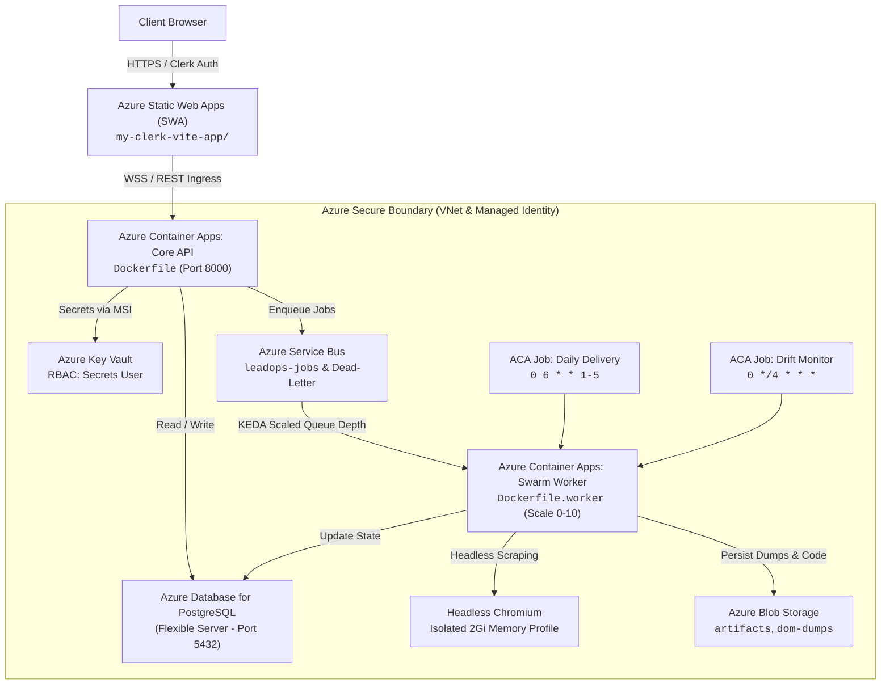

# Azure Cloud Deployment & Infrastructure Skill

Use this skill to provision, deploy, configure, troubleshoot, and verify the production LeadOps cloud architecture on Microsoft Azure. It governs the end-to-end cloud lifecycle using Azure Bicep, Azure CLI, Azure MCP Server (`@azure/mcp`), and automated CI/CD pipelines.

---

## 🧭 Architecture Blueprint & Resource Map



### Component-to-Azure Inventory

| Component | Code / Directory | Azure Service | Key Sizing / Configuration |
| :--- | :--- | :--- | :--- |
| **Frontend Portal** | `my-clerk-vite-app/` | **Azure Static Web Apps (SWA)** | Standard tier, edge CDN, Clerk routing |
| **Core API & Control Plane** | `agents/api.py`, `Dockerfile` | **Azure Container Apps (ACA)** | External ingress (port 8000), WSS enabled, 0.5 CPU / 1.0 Gi |
| **Autonomous Swarm Worker** | `agents/worker.py`, `Dockerfile.worker` | **ACA (KEDA Background Worker)** | Scale-to-zero, KEDA queue trigger, 1.0 CPU / 2.0 Gi (Playwright) |
| **Message Broker & Queue** | `agents/service_bus.py` | **Azure Service Bus** | Standard namespace, `leadops-jobs`, dead-letter queue |
| **Relational Store** | `agents/storage.py`, `models.py` | **Azure PostgreSQL Flexible Server** | `Standard_B1ms` (dev/staging) / `Standard_D2s_v3` (prod) |
| **Artifact & Scraping Storage**| `agents/blob_storage.py` | **Azure Blob Storage** | Hot tier, containers: `artifacts`, `dom-dumps`, `post-mortems` |
| **Scheduled Automation** | `agents/delivery.py`, `drift_monitor.py` | **ACA Scheduled Jobs** | Cron triggers: `0 6 * * 1-5` (delivery), `0 */4 * * *` (drift) |
| **Secrets & Keys** | `.env`, `infra/bicep/modules/keyvault.bicep` | **Azure Key Vault** | UserAssigned Managed Identity, RBAC authorization |

---

## 🛠️ Azure MCP Server Tooling Reference

The workspace includes `@azure/mcp` configured in `.agents/mcp_config.json`. The server provides deep, native control over Azure resources:

### Core Service Namespaces Available

- **`azure_containerapp`**: Inspect, update revisions, scale rules, and query logs of Container Apps and Jobs.
- **`azure_postgres`**: Inspect PostgreSQL Flexible Server instances, query firewall settings, and run diagnostic checks.
- **`azure_servicebus`**: Inspect queue depths, dead-letter message counts, active listeners, and message purging.
- **`azure_storage`**: Manage storage accounts, inspect blob containers, generate SAS tokens, and verify upload payloads.
- **`azure_keyvault`**: Verify secret metadata, RBAC assignments, and secret rotation status.
- **`azure_role`**: Audit RBAC permissions and ensure Managed Identity has requisite role definitions.
- **`azure_pricing`**: Fetch real-time Azure retail pricing for target SKUs (`Standard_B1ms`, ACA vCPU/RAM).
- **`azure_bicep`**: Validate and analyze Bicep infrastructure templates before deployment.

---

## 📋 Step-by-Step Deployment Runbook

### Pre-flight Checklist
1. Ensure the user is logged in via Azure CLI:
   ```powershell
   az account show
   ```
2. Verify target subscription and set default:
   ```powershell
   az account set --subscription "<subscription-id>"
   ```
3. Register necessary Azure resource providers (one-time requirement per subscription):
   ```powershell
   az provider register --namespace Microsoft.App
   az provider register --namespace Microsoft.OperationalInsights
   az provider register --namespace Microsoft.DBforPostgreSQL
   az provider register --namespace Microsoft.ServiceBus
   az provider register --namespace Microsoft.Storage
   az provider register --namespace Microsoft.KeyVault
   az provider register --namespace Microsoft.Web
   ```

---

### Step 1: Automated Infrastructure Provisioning (Bicep)

Execute the end-to-end deployment script [scripts/deploy_azure.ps1](file:///c:/Users/ben/Documents/leadops2/scripts/deploy_azure.ps1) or run direct CLI commands:

```powershell
# 1. Create Resource Group
az group create --name rg-leadops-production --location eastus

# 2. Deploy Modular Bicep Orchestrator
az deployment group create `
  --resource-group rg-leadops-production `
  --template-file infra/bicep/main.bicep `
  --parameters `
      environmentName=production `
      location=eastus `
      postgresAdminUser=leadopsadmin `
      postgresAdminPassword="<SecurePassword123!>" `
      acrLoginServer="crleadops.azurecr.io" `
      imageTag="latest" `
      leadopsApiToken="<GeneratedApiToken>"
```

The Bicep modules automatically configure:
1. **Network**: Dedicated VNet with `snet-aca` (`10.0.0.0/23`) delegated to `Microsoft.App/environments` and `snet-postgres` (`10.0.2.0/24`) delegated to `Microsoft.DBforPostgreSQL/flexibleServers`.
2. **Database**: PostgreSQL Flexible Server with `require_secure_transport=on` and database `leadops`.
3. **Storage**: Storage Account with blob containers `artifacts`, `dom-dumps`, and `post-mortems`.
4. **Service Bus**: Standard namespace with `leadops-jobs` and `leadops-deadletter`.
5. **Key Vault**: Managed Identity granted `Key Vault Secrets User` role.
6. **Container Apps**: API gateway with ingress and KEDA worker scaling to 0 on queue depth.

---

### Step 2: Database Migration & Zero-Loss Data Transfer

1. Run Alembic schema migrations against the live Azure PostgreSQL Flexible Server:
   ```powershell
   $env:DATABASE_URL = "postgresql://<user>:<password>@<server>.postgres.database.azure.com:5432/leadops?sslmode=require"
   python -m alembic -c agents/alembic.ini upgrade head
   ```

2. Safely transfer existing data from `leadops.db` into Azure PostgreSQL:
   ```powershell
   python scripts/migrate_sqlite_to_postgres.py --sqlite-path leadops.db --database-url $env:DATABASE_URL
   ```

---

### Step 3: Container Image Build & ACR Publishing

Build both production images using Azure Container Registry tasks (no local Docker daemon required):

```powershell
# Build and push Core API Gateway
az acr build --registry crleadops --image leadops-api:latest -f Dockerfile .

# Build and push Autonomous Swarm Worker (with Playwright Chromium)
az acr build --registry crleadops --image leadops-worker:latest -f Dockerfile.worker .
```

---

### Step 4: Container Apps Verification & KEDA Scaling Check

1. **Verify API Gateway Health**:
   ```powershell
   $apiUrl = az containerapp show --name aca-leadops-api-production --resource-group rg-leadops-production --query "properties.configuration.ingress.fqdn" -o tsv
   curl "https://$apiUrl/health"
   # Expected response: {"status":"healthy"}
   ```

2. **Verify Worker KEDA Scaling to Zero**:
   ```powershell
   az containerapp show --name aca-leadops-worker-production --resource-group rg-leadops-production --query "properties.template.scale"
   # minReplicas should be 0; replicas will spin up only when messages enter 'leadops-jobs'
   ```

3. **Verify Scheduled Jobs**:
   ```powershell
   az containerapp job list --resource-group rg-leadops-production -o table
   # Should list 'job-daily-delivery-production' and 'job-drift-monitor-production'
   ```

---

## 🔍 Diagnostics & Troubleshooting

| Symptom | Probable Cause | Resolution |
| :--- | :--- | :--- |
| **API cannot connect to PostgreSQL** | Missing VNet delegation or SSL mode parameter | Verify connection string ends with `?sslmode=require`. Ensure subnet delegation is set to `Microsoft.DBforPostgreSQL/flexibleServers`. |
| **Key Vault secret access denied** | Missing Managed Identity RBAC assignment | Ensure User-Assigned Identity has `Key Vault Secrets User` (`4633458b-17de-408a-b874-0445c86b69e6`) on the Key Vault scope. |
| **Worker pod crashes on browser crawl** | Playwright Chromium dependencies missing | Use `Dockerfile.worker` which executes `playwright install --with-deps chromium`. Allot at least `2.0Gi` RAM in container resources. |
| **Service Bus queue messages not consumed** | KEDA trigger auth failure or wrong queue name | Check `aca-leadops-worker` system logs. Verify secret `servicebus-connection-string` is properly referenced by the KEDA scale rule. |
| **WebSocket disconnects on `/ws`** | ACA ingress transport set to HTTP instead of Auto | In `containerapps.bicep`, verify `ingress.transport: 'auto'` is set to support persistent WebSocket connections. |
---
