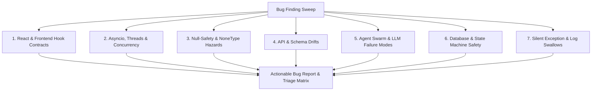

# 🐞 Bug Finding & Autonomous Defect Discovery Skill

Use this skill whenever tasked with:
- Proactively hunting for bugs, runtime crashes, and architectural defects.
- Investigating console exceptions (e.g., `TypeError: x.method is not a function`, `UnhandledPromiseRejection`, `KeyError`, `AttributeError: 'NoneType' object has no attribute`).
- Finding silent logic errors, dropped data, or race conditions across the autonomous swarm.
- Verifying regression-free releases after substantial refactors.

---

## 🏛️ The 7 Defect Discovery Vectors

Every bug hunt must systematically inspect code against these seven defect vectors:



### 1. React & Frontend Hook Contracts
- **Missing Hook Return Exports**: A custom hook declares `const [data, setData] = useState(...)`, and consuming pages call `hook.setData(...)`, but `setData` is omitted from the hook's `return { ... }` statement. (Direct cause of `TypeError: x.setX is not a function`).
- **Stale Closures & Dependency Arrays**: `useEffect` or `useCallback` omitting mutable states, causing actions to run against stale closures.
- **Unguarded Deep Lookups**: `lead.enrichment_data.contacts[0].email` rendering without optional chaining (`?.`), triggering unhandled React render crashes on partial data.
- **Silent Catch Blocks**: `try { ... } catch (e) {}` swallowing fetch or rendering errors, hiding critical telemetry from users.

### 2. Asyncio, Multithreading & Concurrency Traps
- **Unawaited Coroutines**: Calling `async def` functions without `await`, returning `<coroutine object ...>` instead of data, which evaluates as truthy in conditionals!
- **Blocking Calls in Event Loops**: Running long synchronous network requests (`requests.get`, `time.sleep`) directly inside `async def` routes, blocking the entire server process. Must use `asyncio.to_thread` or `aiohttp`/`httpx`.
- **SQLite Multi-Thread Affinity**: SQLite connections cannot be shared across multiple threads without `check_same_thread=False` or dedicated connection pooling.
- **Uncaught Background Thread Crashes**: `threading.Thread(target=worker).start()` dying silently because the worker has no top-level `try/except` with error logging.

### 3. Null-Safety & NoneType Hazards
- **Unguarded String Operations**: Calling `.lower()`, `.strip()`, or `.split()` on variables from DB rows or API responses that may be `None`:
  ```python
  # ❌ HAZARD: If contact_email is NULL/None, raises AttributeError
  if lead.contact_email.lower().endswith("@gmail.com"):
  
  # ✅ SAFE:
  if (lead.contact_email or "").strip().lower().endswith("@gmail.com"):
  ```
- **Dict Key Assumptions**: Accessing `res["field"]` instead of `res.get("field")` on external API responses, causing `KeyError` when upstream vendors change payloads.

### 4. API & Schema Drifts
- **Endpoint Response Deserialization**: Frontend expecting `{ leads: [...] }` while backend returns `{ results: [...], total: ... }`.
- **HTTP Status Semantics**: Treating all non-200 responses as unhandled exceptions instead of parsing structured 422 validation errors or 401 token refreshes.
- **Form Data vs JSON**: Sending multipart form headers when endpoint expects `application/json`, or vice-versa.

### 5. Agent Swarm & LLM Failure Modes
- **JSON Markdown Block Decoding**: LLMs wrapping responses in ` ```json ... ``` `, causing `json.loads()` to throw `json.decoder.JSONDecodeError`. Must use robust JSON extractors (`re.search(r"\{.*\}", text, re.DOTALL)`).
- **Context Window Overflows**: Passing raw DOM or unpruned text to LLM context (> 4,000 tokens), causing rate-limit or context length errors.
- **Infinite Retry Loops**: Retry policies without exponential backoff, jitter, or hard exit caps, leading to API quota exhaustion.
- **Killswitch Bypasses**: Background workers or supervisors dispatching actions (e.g. emails) without re-checking global kill-switch flags (`AUTO_OUTREACH_ENABLED`, `EMERGENCY_STOP`).

### 6. Database & State Machine Safety
- **Invalid State Transitions**: Skipping validation gates (e.g. moving a lead from `NEW` straight to `DEPLOYED` without QA pass).
- **Leaked Transaction Locks**: Unhandled errors inside a DB cursor leaving transactions uncommitted or un-rolled-back, locking SQLite/PostgreSQL tables.
- **Raw SQL Formatting**: Using f-strings (`f"SELECT * FROM leads WHERE id = '{lead_id}'"`) instead of parameterized queries (`?` or `%s`), causing SQL injection and escaping syntax crashes.

### 7. Silent Exception & Log Swallows
- **Bare `except:` or `except Exception: pass`**: Hiding critical bugs from telemetry and making production systems impossible to debug.
- Every exception handler MUST either log the exception (`logger.exception("...")`), update pipeline telemetry, or re-raise with context.

---

## 🛠️ Automated Bug Discovery Workflow

Execute these 5 steps to conduct a thorough bug hunt:

### Step 1: Run the Automated Static Bug Scanner
Execute the workspace bug scanner to discover known defect patterns:
```powershell
python .agents/skills/bug-finding/scripts/scan_bugs.py
```

### Step 2: Frontend Contract & Build Verification
Verify that the React frontend compiles cleanly and has zero missing imports or syntax mismatches:
```powershell
cd frontend
npm run build
```

### Step 3: Run Full Backend Test Suites
Execute the pytest suite with verbose output to surface any regressions, mock leaks, or assertion failures:
```powershell
pytest -v --tb=short
```

### Step 4: Trace Telemetry & Log Audits
Search recent logs and source files for unhandled error signatures:
- Grep for `console.error`, `console.warn`, and empty catch blocks in `frontend/src/`
- Grep for `except Exception: pass` in `agents/` and `backend/`
- Check active SQLite database state for corrupted rows or orphaned states:
  ```powershell
  python -c "import sqlite3; conn=sqlite3.connect('leadops.db'); print(conn.execute('SELECT state, count(*) FROM leads GROUP BY state').fetchall())"
  ```

### Step 5: Triage & Remediate
For each discovered defect:
1. **Reproduce**: Identify the exact trigger condition and reproduction steps.
2. **Isolate**: Pinpoint the file and line number causing the defect.
3. **Patch**: Apply a complete, production-ready fix (NO stubs, NO mock workarounds).
4. **Verify**: Re-run the test suite and static scanner to confirm zero regressions.

---

## 📋 Defect Severity & Triage Matrix

| Severity | Definition | SLA / Action |
| :--- | :--- | :--- |
| 🚨 **CRITICAL** | System crash, unhandled exception in active user flow, data loss, SQL injection, unauthorized dispatch | Immediate fix before any other work |
| ⚠️ **HIGH** | Hook contract mismatch, unhandled Promise rejection, broken API route, missing killswitch guard | Fix immediately in current sprint |
| ⚡ **MEDIUM** | Null-dereference hazard on nullable field, unhandled error code, slow sync query in async route | Remediate with safe guards (`or ""`, `.get()`) |
| ℹ️ **LOW** | Missing log context, unoptimized re-render, unused variable | Clean up during routine maintenance |
