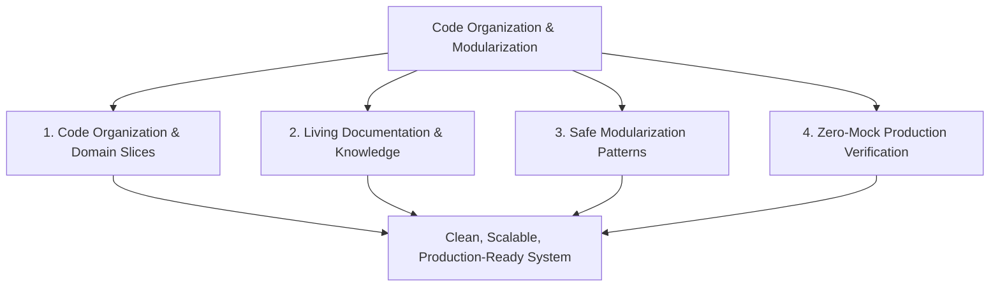
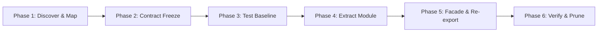

# 🧱 Code Organization, Documentation & Modularization Refactoring Skill

Use this skill when organizing disorganized or sprawling codebases, decomposing monolithic "God files", establishing living documentation systems, and executing safe, zero-downtime modular refactors across full-stack Python (FastAPI, agent swarms, async scrapers) and React (Vite, custom hooks, Tailwind/vanilla CSS) architectures.

---

## 🎯 When to Use This Skill

Activate this skill when:
- 📦 **Reorganizing Code Structure**: Restructuring messy, sprawling, or flat directory structures into clean, domain-driven vertical slices.
- 🔪 **De-monolithizing "God Files"**: Deconstructing 400+ LOC monolithic scripts (e.g., `run_server.py`, mega-routers, massive React components) into cohesive submodules without breaking existing callers.
- 📖 **Establishing Living Documentation**: Authoring Architectural Decision Records (ADRs), Google/NumPy-style docstrings, TSDoc types, package READMEs, and visual Mermaid architecture diagrams.
- 🔌 **Decoupling Dependencies & Breaking Cycles**: Untangling circular imports, applying Dependency Inversion (Protocols/Interfaces), and introducing clean Service Layers.
- 🛡️ **Executing Safe Refactors**: Applying the Strangler Fig pattern and backward-compatible facades to guarantee zero regressions during continuous development.
- ⚡ **Enforcing Zero-Mock & Clean Code Rules**: Upgrading legacy stubs or ad-hoc scripts to fully typed, production-ready, zero-mock live data implementations.

---

## 🏛️ The 4 Pillars of Modular Architecture & Documentation



| Pillar | Focus Area | Core Standards | Primary Objective |
| :--- | :--- | :--- | :--- |
| **1. Code Organization** | Directory Hierarchy & Boundaries | Vertical feature slices, Clean Architecture layers, explicit `__all__`/barrel exports. | Eliminate cognitive load and enforce clear domain ownership. |
| **2. Living Documentation** | System Clarity & Architecture | Google docstrings, TSDoc, Mermaid sequence diagrams, ADRs, domain READMEs. | Turn the codebase into self-documenting, living knowledge. |
| **3. Safe Modularization** | De-monolithization & Decoupling | Strangler Fig pattern, Service Layer extraction, Dependency Inversion, Facades. | Deconstruct massive files with zero downtime or breaking changes. |
| **4. Zero-Mock Verification** | Integrity & Production Standards | Strict live data feeds, zero placeholders, complete error handling, regression tests. | Guarantee hardened code that works in live production environments. |

---

## 📋 Step-by-Step Refactoring Lifecycle

Execute refactoring systematically across these 6 sequential phases:



### Phase 1: Discovery & Dependency Mapping
1. **Identify the Monolith / Smell**:
   - Locate files exceeding 400 lines of code, classes exceeding 200 lines, or functions exceeding 40 lines.
   - Example targets: monolithic server files (`run_server.py`), 500-line React components, scripts mixing database queries with route handling and scraping logic.
2. **Trace Afferent & Efferent Coupling**:
   - Map all inbound callers (who imports or calls this code?).
   - Map all outbound dependencies (what does this code import or query?).
   - Detect any circular imports or tight coupling to global state.

### Phase 2: Contract & Interface Freezing
1. **Define Strict Data Contracts**:
   - Before moving any implementation logic, define immutable Pydantic schemas (Python) or TypeScript interfaces.
   - Ensure all input payloads and return values have explicit types.
   - Prohibit untyped dictionaries (`dict`, `any`, generic `Object`) across boundaries.
2. **Define Abstract Service Protocols**:
   - In Python, define typing `Protocol` classes for external dependencies (e.g., email dispatchers, database repositories, browser scrapers).

### Phase 3: Safety Baseline & Test Verification
1. **Execute Baseline Tests**:
   - Run existing automated test suites:
     ```powershell
     pytest tests/ -q
     ```
2. **Establish Harness if Missing**:
   - If test coverage for the target logic is absent or low, write a deterministic integration or smoke test *before* altering code.
   - Test against real environments or dedicated integration fixtures—**never introduce mock data into production code**.

### Phase 4: Modular Extraction (Pure Logic -> I/O -> Orchestration)
1. **Extract Pure Domain Logic First**:
   - Isolate calculation, parsing, date formatting, and validation logic into pure functions with zero side-effects.
2. **Extract Infrastructure / Clients**:
   - Encapsulate third-party APIs (PayPal, ACS, SendGrid, Playwright) into dedicated client classes.
3. **Assemble Domain Service**:
   - Build the orchestrating Domain Service class that coordinates domain entities and infrastructure clients.
4. **Encapsulate Public Interface**:
   - Define `__all__` in the new package's `__init__.py` to expose only intentional public interfaces.

### Phase 5: Facade Preservation & Backward Compatibility
1. **Deploy Stable Facade**:
   - In the legacy entrypoint file, replace the extracted logic with a thin delegating call to the new module.
   - Retain identical function/method signatures.
2. **Add Deprecation Warnings**:
   - Annotate legacy functions with `@deprecated` docstrings directing future developers to the new modular import.
3. **Incremental Caller Migration**:
   - Migrate callers one-by-one to import directly from the new domain module.

### Phase 6: Production Verification, Documentation & Pruning
1. **Run Full Test Suite**:
   - Verify 100% test pass rate with zero regressions.
2. **Live Data Smoke Test**:
   - Trigger a real live transaction or query to confirm end-to-end telemetry and database state.
3. **Author Documentation**:
   - Create or update the domain package `README.md` with a Mermaid flow diagram.
   - Create an ADR in `docs/adr/` if introducing a new architectural paradigm.
4. **Prune Dead Code**:
   - Once all callers are migrated, safely prune the legacy facade and unused imports.

---

## 📐 Full-Stack Architectural Standards

### 1. Python & FastAPI Backend Standards

#### Layered Clean Architecture:
```
backend/ or agents/
├── domain/                      # Pure business logic, entities, value objects
├── services/                    # Orchestration, agent swarms, workflows
├── api/                         # FastAPI routers, request/response models
├── infra/                       # Database ORM, migrations, external API clients
└── config/                      # Pydantic BaseSettings, dynamic environment
```

#### Monolith Decomposition Rules:
- **FastAPI Routers**: Max **40 lines** per route handler. Routers only validate HTTP payloads, pass work to domain services, and return status codes.
- **Domain Services**: Encapsulate transactions and workflow logic. Max **200 lines** per service class; decompose larger workflows into specialized sub-services.
- **Typed Schemas**: Always return explicit Pydantic response models, never raw ORM models or dictionaries.
- **Async Concurrency Safety**: Always use async context managers for sessions (`async with session_scope() as session:`).

### 2. React & Frontend Standards

#### Feature-Driven Vertical Slicing:
```
frontend/src/
├── features/<feature-name>/     # Self-contained business slice
│   ├── components/              # Sub-components specific to this feature
│   ├── hooks/                   # Stateful hooks (useSandboxData, useCheckout)
│   ├── services/                # API client functions for this feature
│   └── index.js                 # Public barrel export
├── shared/                      # True cross-cutting components only
└── App.jsx
```

#### Component Architecture Rules:
- **Zero Mock Data in UI**: Always wire components to real API responses or loading states. Never hardcode mock customer rows or static stub arrays.
- **Container vs. Presentational Separation**:
  - Container component handles state fetching and error boundaries.
  - Presentational components remain pure functions of their props.
- **Custom Hook Encapsulation**: Move API polling, WebSockets, or multi-step form logic into dedicated custom hooks (`useFeatureWorkflow.js`).

---

## 📚 Living Documentation Checklist

Every modularized package must satisfy the following documentation standards:

1. **Google/NumPy Docstrings**:
   - Every public module, class, and method has full docstrings with `Args:`, `Returns:`, `Raises:`, and usage examples.
2. **Domain `README.md`**:
   - Explains inputs, outputs, downstream consumers, and operational rules.
   - Includes a visual Mermaid architecture or sequence diagram.
3. **Architectural Decision Record (ADR)**:
   - Required whenever breaking a monolith, introducing a new database model, or switching a third-party service provider.
4. **Type Completeness**:
   - 100% type annotated in Python (`typing`, `Pydantic`) and TypeScript/TSDoc.

---

## 🔗 Reference Guides & Tooling

Detailed guides and templates are available in the `references/` directory:

- [Modularization Patterns](file:///c:/Users/ben/Documents/leadops2/.agents/skills/code-organization-modularization-refactor/references/modularization_patterns.md): Concrete implementations of Strangler Fig, Service Layers, Dependency Inversion, and React Feature Folders.
- [Documentation Standards](file:///c:/Users/ben/Documents/leadops2/.agents/skills/code-organization-modularization-refactor/references/documentation_standards.md): Ready-to-use templates for ADRs, Google Docstrings, TSDoc, package READMEs, and Mermaid diagrams.
- [Refactoring Checklist](file:///c:/Users/ben/Documents/leadops2/.agents/skills/code-organization-modularization-refactor/references/refactoring_checklist.md): 16-point gatekeeper checklist covering pre-flight, in-flight, documentation, and post-refactor verification.
