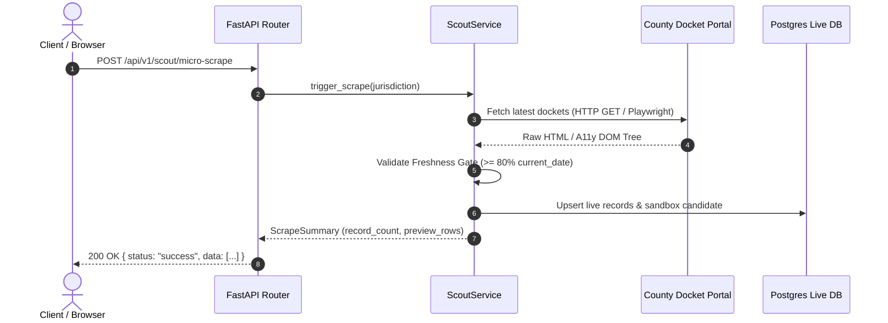
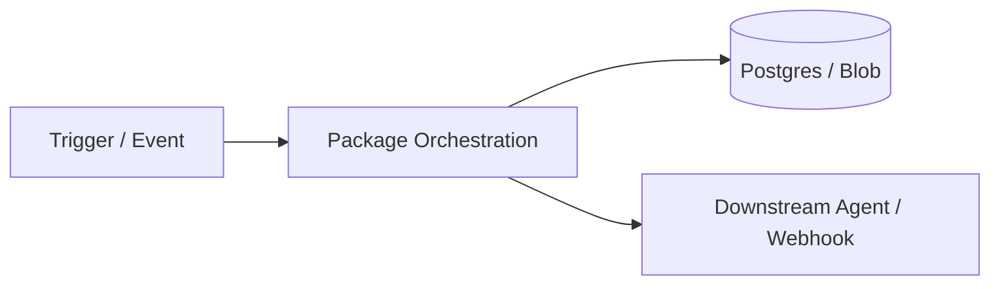

# 📚 Living Documentation Standards & Templates

High-performing engineering teams treat documentation as a living part of the codebase. Code explains *what* and *how*; documentation and type contracts explain *why*, *boundaries*, and *invariants*.

---

## 1. Architectural Decision Record (ADR) Template

Store ADRs in `docs/adr/` or within the domain package `agents/<domain>/docs/ADR-XXXX.md`.

```markdown
# ADR-0001: [Short Title of the Decision]

- **Status**: [Proposed | Accepted | Superseded | Deprecated]
- **Date**: YYYY-MM-DD
- **Author(s)**: [Author Name / Agent]
- **Deciders**: [Stakeholders / Agents]
- **Supersedes / Superseded By**: [Link to previous/next ADR if applicable]

## 1. Context & Problem Statement
Describe the technical or business context, friction point, or performance bottleneck.
What forces are at play? What constraints must be respected (e.g., $99 Sprint rules, zero-mock live data, rate limits)?

## 2. Decision
State the chosen architectural solution in clear, definitive terms.
Explain the core abstraction, domain model, or design pattern introduced.

## 3. Consequences
### Positive:
- [Benefit 1: e.g., De-coupled route logic allows isolated unit tests]
- [Benefit 2: e.g., Eliminated circular imports between Pitcher and Scout]

### Negative / Trade-offs:
- [Trade-off 1: e.g., Requires one extra layer of indirection via Domain Service]
- [Mitigation: e.g., Dependency injection container handles lifecycle automatically]

## 4. Alternatives Considered
| Option | Pros | Cons | Reason Rejected |
| :--- | :--- | :--- | :--- |
| **Option A (Inline Handler)** | Fast initial edit | God-file bloat, untestable | Violates SRP & maintainability |
| **Option B (Separate Microservice)**| Total process isolation | Devops overhead, high latency | Premature optimization |
| **Option C (Chosen: Domain Service)**| Clean boundaries, zero overhead| None | Selected |

## 5. Verification & Telemetry
How do we prove this decision is working? (e.g., test suite pass, latency metric under 200ms, zero-downtime deployment).
```

---

## 2. Python Google-Style Docstring Standard

Every public module, class, method, and function in Python must have an exhaustive Google-style docstring with explicit type annotations.

### Module Level:
```python
"""
agents.scout.service
~~~~~~~~~~~~~~~~~~~~

This module provides the core orchestration engine for the Scout Agent.
It discovers high-intent B2B targets operating in municipal public-records
verticals and executes 10-second micro-scrapes for live records.

Invariants:
    - Same-day freshness gate: >= 80% of rows must carry today's filing date.
    - Zero mock data: All records originate from live county/municipal portals.
    - Cache invalidation: Candidate cache drops automatically if older than 24 hours.
"""
```

### Class & Method Level:
```python
class ScoutMicroScraper:
    """Executes deterministic, low-footprint micro-scrapes on county docket portals.

    Attributes:
        portal_url (str): The verified URL of the target municipal portal.
        timeout_seconds (int): Maximum wait time before aborting the micro-scrape.
        session (ClientSession): Active HTTP or Playwright browser session.
    """

    def __init__(self, portal_url: str, timeout_seconds: int = 10) -> None:
        """Initializes the ScoutMicroScraper with target URL and timeout.

        Args:
            portal_url: Fully qualified URL to the public docket search portal.
            timeout_seconds: Timeout threshold in seconds (default is 10s).

        Raises:
            ValueError: If `portal_url` is malformed or lacks HTTP/HTTPS scheme.
        """
        self.portal_url = portal_url
        self.timeout_seconds = timeout_seconds

    async def extract_today_filings(
        self,
        jurisdiction: str,
        max_records: int = 10
    ) -> List[DocketRecord]:
        """Scrapes and parses today's public filings for the specified jurisdiction.

        Args:
            jurisdiction: Standardized county or city jurisdiction code (e.g., 'fl-miami-dade').
            max_records: Maximum number of sample rows to extract (default is 10).

        Returns:
            A list of `DocketRecord` objects containing verified case numbers, filing dates,
            and party details.

        Raises:
            PortalUnreachableError: Target court website is offline or timing out.
            WAFBlockedError: Cloudflare or bot protection intercepted the request.
            FreshnessGateError: Less than 80% of extracted rows match today's date.

        Example:
            >>> scraper = ScoutMicroScraper("https://dockets.county.gov")
            >>> records = await scraper.extract_today_filings("miami-dade", max_records=5)
            >>> len(records) >= 5
            True
        """
        ...
```

---

## 3. TypeScript / React TSDoc Standard

Use TSDoc annotations for React components, custom hooks, and shared utilities:

```typescript
/**
 * Props for the `SandboxTable` component.
 */
interface SandboxTableProps {
  /** List of verified, live scraped filing records */
  records: DocketRecord[];
  /** Flag indicating whether the background live scrape is in-flight */
  isLoading: boolean;
  /** Callback fired when the user selects a target record row */
  onSelectRecord?: (record: DocketRecord) => void;
  /** Optional custom CSS class name for container styling */
  className?: string;
}

/**
 * Renders an interactive, live-verified docket record table in the prospect sandbox.
 *
 * Enforces zero-mock live data rendering and highlights same-day verification badges.
 *
 * @param props - Component properties conforming to {@link SandboxTableProps}.
 * @returns The rendered JSX element.
 *
 * @example
 * ```tsx
 * <SandboxTable
 *   records={liveRecords}
 *   isLoading={isScraping}
 *   onSelectRecord={(rec) => openRecordModal(rec)}
 * />
 * ```
 */
export const SandboxTable: React.FC<SandboxTableProps> = ({
  records,
  isLoading,
  onSelectRecord,
  className = ""
}) => {
  ...
};
```

---

## 4. Visual Living Architecture (Mermaid Standards)

Complex flows must be visually documented using GitHub-flavored Mermaid diagrams directly inside the package `README.md`.

### Standard Sequence Diagram Pattern:


---

## 5. Domain Package README Template

Place a `README.md` in every high-level domain package (e.g., `agents/scout/README.md`, `agents/pitcher/README.md`, `frontend/src/features/sandbox/README.md`):

```markdown
# [Domain / Package Name]

Brief 1-2 sentence statement of what this package accomplishes and its operational role in the LeadOps Swarm.

---

## 🏛️ Architecture & Boundaries

- **Input Triggers**: [What starts execution in this package? e.g., cron at 06:00 UTC, HTTP POST from frontend, Service Bus event]
- **Outputs / Artifacts**: [What does this package produce? e.g., Live sandbox records, Google Sheets sync, PayPal order]
- **Downstream Consumers**: [Who uses this output? e.g., Pitcher Agent, Client Portal, QA Gatekeeper]



---

## 📦 Package Layout

```
agents/<package>/
├── __init__.py          # Public API facade & __all__ exports
├── service.py           # Core domain business logic & orchestration
├── client.py            # External API / network client (WAF, Playwright, HTTP)
├── models.py            # Strict Pydantic domain models & request/response schemas
├── exceptions.py        # Domain-specific typed exception classes
└── tests/               # Unit and integration tests for this package
```

---

## 🚀 Quick Start / Usage

```python
from agents.domain import DomainService, DomainRequest

service = DomainService()
result = await service.execute(DomainRequest(...))
```

---

## ⚠️ Invariants & Operational Rules

1. **Rule 1**: [e.g., Same-Day Freshness Gate >= 80%]
2. **Rule 2**: [e.g., Zero Mock Data in production code paths]
3. **Rule 3**: [e.g., No plaintext URLs in Touch 1 outreach]
```
