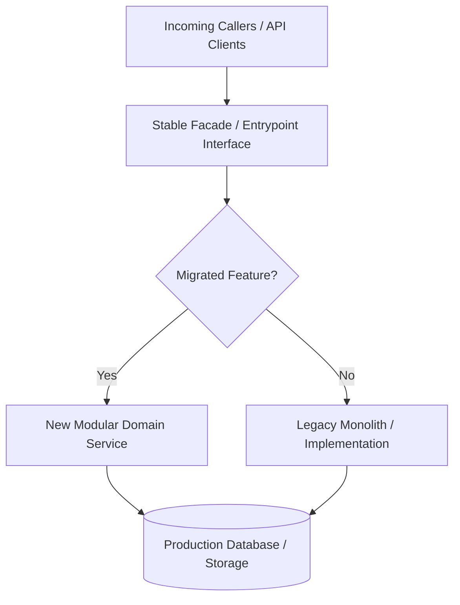
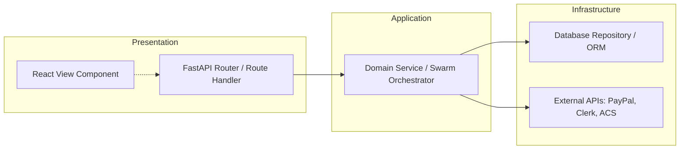

# 🏗️ Modularization & Refactoring Architectural Patterns

This guide details the core architectural patterns for modularizing monolithic codebases, untangling tightly coupled modules, and executing safe, zero-downtime refactors across full-stack Python (FastAPI/swarms) and React ecosystems.

---

## 1. The Strangler Fig Pattern (Zero-Downtime Migration)

The Strangler Fig pattern allows you to incrementally replace legacy monoliths or monolithic files (e.g., massive router files or multi-thousand-line scripts) with modular components behind a stable interface.



### Implementation Steps:
1. **Preserve the Existing Call Signature**: Do not change how callers invoke the existing entrypoint.
2. **Implement New Modular Package**: Build the new clean domain module with isolated responsibility, strict typing, and test coverage.
3. **Delegate Incrementally**: Update the original entrypoint to forward calls to the new module one function/endpoint at a time.
4. **Deprecate & Migrate**: Update callers to import directly from the new module.
5. **Prune Legacy Code**: Once all callers are migrated and telemetry confirms zero legacy traffic, remove the legacy implementation.

### Example in Python (FastAPI / Swarm Services):
```python
# Before (Legacy Monolithic Entrypoint: run_server.py)
# Contains 800+ lines mixing routing, database queries, LLM calls, and validation.

# Step 1: New Modular Domain Module: agents/scout/service.py
from typing import List
from pydantic import BaseModel

class ScoutResult(BaseModel):
    jurisdiction: str
    records_count: int
    source_url: str

class ScoutDomainService:
    """Encapsulates pure business logic and orchestration for Scout agent."""
    def __init__(self, db_session, portal_scraper_client):
        self.db = db_session
        self.scraper = portal_scraper_client

    async def execute_live_micro_scrape(self, jurisdiction: str) -> ScoutResult:
        # Real live scraping, validation, and storage
        ...

# Step 2: Backward-Compatible Facade in run_server.py
from agents.scout.service import ScoutDomainService

# Deprecation notice in docstring
def legacy_trigger_scout(jurisdiction: str):
    """
    DEPRECATED: Use `ScoutDomainService.execute_live_micro_scrape` instead.
    Maintained for backward compatibility with external cron scripts.
    """
    service = ScoutDomainService(db_session=get_db(), portal_scraper_client=get_scraper())
    return service.execute_live_micro_scrape(jurisdiction)
```

---

## 2. Service Layer & Separation of Concerns

Route handlers (FastAPI) and UI components (React) must never contain business logic, raw SQL queries, or third-party API orchestration.



### Rule of Responsibility:
- **Router / Controller**: Validates incoming HTTP request body/query, parses auth tokens, delegates to Domain Service, formats response status code. Maximum LOC: **40 lines per endpoint**.
- **Domain Service**: Implements business rules, enforces permissions, orchestrates agents/workers, coordinates database transactions.
- **Repository / Data Access**: Executes queries, handles ORM models, manages database sessions.
- **Client / Adapter**: Wraps third-party APIs (PayPal orders, SendGrid/ACS emails, Playwright headless browsers).

---

## 3. The Facade & Re-Export Pattern (Encapsulation)

Expose a clean, cohesive public API while keeping internal helper classes, sub-routines, and private utilities strictly encapsulated.

### Python Encapsulation via `__init__.py` and `__all__`:
```python
# agents/pitcher/__init__.py
"""
Pitcher Domain Package: Governs cold outreach, deliverability gates,
and inbound objection handling via the Alex persona.
"""
from .service import PitcherService
from .models import PitchRequest, PitchDeliveryResult
from .exceptions import PitchDeliveryError, RateLimitExceeded

__all__ = [
    "PitcherService",
    "PitchRequest",
    "PitchDeliveryResult",
    "PitchDeliveryError",
    "RateLimitExceeded",
]
```

### React / Frontend Barrel Export Pattern:
```javascript
// frontend/src/features/sandbox/index.js
export { SandboxDashboard } from './components/SandboxDashboard';
export { useSandboxData } from './hooks/useSandboxData';
export { sandboxService } from './services/sandboxService';
// Internal helpers, sub-components, and private styling remain unexported
```

---

## 4. Dependency Inversion & Injection (DIP)

High-level policy modules should not instantiate low-level concrete dependencies directly. Instead, depend on abstract interfaces (Python `Protocol` or `ABC`) and inject concrete instances.

### Python Protocol-Based Dependency Injection:
```python
from typing import Protocol, List
from pydantic import BaseModel

class EmailDispatchPayload(BaseModel):
    recipient: str
    subject: str
    plain_text_body: str

class EmailTransport(Protocol):
    """Abstract contract for dispatching outbound emails."""
    async def send(self, payload: EmailDispatchPayload) -> str:
        """Sends an email and returns the message ID."""
        ...

# High-level domain service depends on abstraction:
class PitcherNotificationService:
    def __init__(self, transport: EmailTransport):
        self.transport = transport

    async def notify_prospect(self, prospect_email: str, content: str) -> str:
        payload = EmailDispatchPayload(
            recipient=prospect_email,
            subject="Today's filings",
            plain_text_body=content
        )
        return await self.transport.send(payload)
```
*Benefits*:
- Allows seamless switching between Azure Communication Services (ACS), SendGrid, or local SMTP without modifying business logic.
- Enables deterministic unit testing with real interfaces.

---

## 5. React Feature-Based Folder Architecture

Avoid horizontal "layer-only" dumping grounds (`components/`, `helpers/`, `utils/` with 50+ mixed files). Group by business feature / domain vertical slice:

```
frontend/src/
├── features/
│   ├── auth/                    # Auth, Clerk integration, user session
│   │   ├── components/
│   │   ├── hooks/
│   │   ├── services/
│   │   └── index.js
│   ├── sandbox/                 # Bespoke prospect sandbox & lead viewer
│   │   ├── components/
│   │   │   ├── SandboxTable.jsx
│   │   │   ├── TierSelector.jsx
│   │   │   └── SprintDepositModal.jsx
│   │   ├── hooks/
│   │   │   └── useSandboxRecords.js
│   │   ├── services/
│   │   │   └── sandboxApi.js
│   │   └── index.js
│   ├── monitoring/              # 06:00 UTC feed monitors & telemetry
│   └── billing/                 # PayPal $99 Sprint & subscription checkout
├── shared/                      # True cross-cutting components only
│   ├── components/              # Button, Modal, Card, Input, Badge
│   ├── design-system/           # CSS tokens, theme definitions, typography
│   ├── hooks/                   # useDebounce, useLocalStorage, useWindowSize
│   └── utils/                   # dateUtils, formatters, assertions
└── App.jsx
```

### Component Decomposition Rules:
- **Container / Controller Component**: Fetches live data via custom hook, manages high-level state, passes data down. Max LOC: **150 lines**.
- **Presentational Component**: Pure rendering, accepts props, handles UI micro-interactions, emits events. Max LOC: **100 lines**.
- **Custom Hook**: Extracts stateful logic (`useState`, `useEffect`, `useQuery`), handles polling/caching, provides clean return object `{ data, isLoading, error, refetch }`. Max LOC: **80 lines**.
