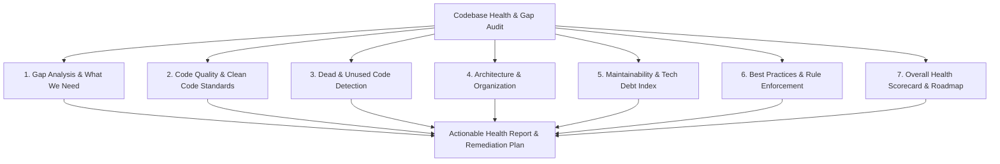
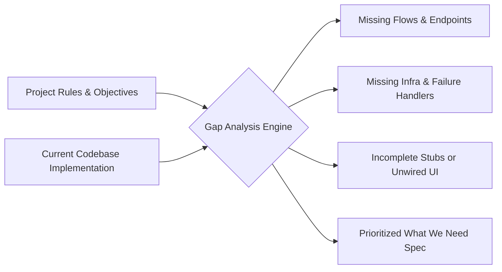

# 🩺 Codebase Health, Gap Analysis & Code Quality Skill

Use this skill to conduct an exhaustive, multi-dimensional health audit of any full-stack repository or autonomous AI agent system. This skill evaluates **code quality, structural organization, dead/unused code, architectural maintainability, technical debt, best practices compliance**, and performs a rigorous **gap analysis** ("what we have vs. what we need").

---

## 🎯 When to Use This Skill

Activate this skill when:
- 🔍 **Conducting a Comprehensive Codebase Health Check**: Evaluating overall project vitality, structure, and reliability.
- 🧩 **Running Architectural Gap Analysis**: Identifying missing features, unhandled edge cases, missing failure modes, infrastructure gaps, or unbuilt requirements.
- 🧹 **Dead Code & Bloat Elimination**: Detecting orphaned files, unused imports, dangling routes, unreachable code, obsolete dependencies, and dead state.
- 📐 **Assessing Code Quality & Maintainability**: Auditing cyclomatic complexity, monolithic "God files", DRY violations, and cognitive debt.
- 🏗️ **Architectural Organization & Cohesion**: Restructuring messy directories, breaking circular dependencies, and establishing clean domain boundaries.
- ⭐ **Enforcing Modern Best Practices**: Auditing Python async safety, typing, Pydantic schemas, React hook hygiene, error boundaries, and zero-mock live data rules.
- 📊 **Producing a Prioritized Health Scorecard**: Generating a clear 0–100 Health Index, radar breakdown, and P0/P1/P2/P3 remediation action plan.

---

## 🏛️ The 7 Pillars of Codebase Health & Gap Analysis



| Pillar | Focus Area | What It Evaluates | Primary Objective |
| :--- | :--- | :--- | :--- |
| **1. Gap Analysis ("What We Need")** | Requirements vs. Reality | Unimplemented flows, missing error handlers, missing webhooks, database index gaps, missing worker tasks. | Eliminate operational voids and feature blindspots. |
| **2. Code Quality** | Craftsmanship & Standards | Strict typing, robust async/await, schema validations, clean abstractions, explicit error propagation. | Ensure readable, resilient, bug-free implementations. |
| **3. Dead & Unused Code** | Bloat & Cleanup | Orphaned modules, unused imports, dead routes, dangling state/props, obsolete test scripts. | Prune cognitive load and minimize attack surface. |
| **4. Architecture & Organization** | Structural Integrity | Separation of concerns, domain boundaries, circular dependencies, file hierarchy, God file pruning. | Create an intuitive, scalable, modular codebase. |
| **5. Maintainability & Tech Debt** | Sustainability | Cyclomatic complexity, DRY violations, duplicated logic, testability, documentation integrity. | Keep development velocity high and onboarding frictionless. |
| **6. Best Practices & Rules** | Engineering Hygiene | Zero-mock enforcement, live data pipelines, secure secrets, React hook rules, async session safety. | Guarantee strict production and operational rule compliance. |
| **7. Health Scorecard & Action Plan** | Synthesis & Remediation | Weighted 0–100 score, pillar radar chart, categorized P0/P1/P2/P3 backlog with effort/impact matrix. | Deliver a definitive roadmap for continuous engineering excellence. |

---

## 📋 Comprehensive Audit Workflow: Phase by Phase

Execute the audit systematically across the following 6 phases.

---

### Phase 1: Codebase Discovery & Architectural Mapping

1. **Repository Inventory**:
   - Scan root layout, configuration files (`pyproject.toml`, `package.json`, `docker-compose.yml`, `.env.example`, `alembic.ini`).
   - Catalog core sub-systems:
     - **Backend / Agent Swarm**: `agents/`, `api/`, `routes/`, `services/`, `models/`, `workers/`.
     - **Frontend Client Portal**: `frontend/src/`, `components/`, `pages/`, `hooks/`, `services/api.js`.
     - **Data Layer**: Database models, migrations, caching layers, storage clients.
     - **External Integrations**: PayPal, Clerk, Stripe, SendGrid, OpenAI/Anthropic/Gemini LLMs, Playwright.

2. **Metric Baseline Extraction**:
   - Measure total lines of code (LOC), file count by extension (`.py`, `.jsx`, `.js`, `.ts`, `.css`, `.sql`).
   - Identify top 10 largest files (God files > 400 LOC) and top 10 most heavily imported modules.

---

### Phase 2: Systematic Gap Analysis ("What We Need")

Perform a strict reconciliation between the system's operational objectives, user rules, and the actual codebase implementation:



#### Gap Analysis Checklist:
- [ ] **Feature & Flow Completeness**:
  - Are all declared user flows (e.g., Scout research -> Pitch -> Sandbox -> $99 Sprint -> QA pass -> Active feed) fully implemented end-to-end?
  - Are any API routes returning placeholder structures or unwired responses?
- [ ] **Error Boundary & Exception Gaps**:
  - Is there a global exception handler on all API routes and background task loops?
  - Do frontend routes have React `<ErrorBoundary>` wrappers to prevent white-screen crashes?
- [ ] **Database & Concurrency Gaps**:
  - Are transactions atomic? Are database sessions properly opened and closed via context managers?
  - Are all foreign keys and high-frequency search columns indexed (`slug`, `email`, `status`, `created_at`)?
- [ ] **Webhook & Idempotency Gaps**:
  - Are inbound webhooks (PayPal, Clerk, Stripe) signed and verified against replay attacks?
  - Are processing handlers idempotent (safe to retry without double-billing or duplicate records)?
- [ ] **Background Processing & Worker Gaps**:
  - Are long-running tasks (scraping, LLM generation, batch emails) offloaded to background workers/queues, or do they block the HTTP event loop?
  - Is there a dead-letter queue or quarantine state for permanently failing tasks?
- [ ] **"Things We Need" Matrix**:
  - Create a structured table detailing:
    - **Capability Gap**: What is missing or incomplete?
    - **Business/Operational Risk**: What happens if this remains unbuilt?
    - **Recommended Solution**: Specific architectural pattern or component needed.
    - **Priority**: P0 (Critical), P1 (High), P2 (Medium), P3 (Low).

---

### Phase 3: Dead & Unused Code Audit (Bloat Elimination)

Identify and flag all dead weight across Python and JavaScript/React surfaces:

#### 3.1 Python Dead Code Detection
- [ ] **Unused Imports & Modules**: Imports declared but never referenced in the file.
- [ ] **Orphaned Functions & Classes**: Private helper functions (`_helper`), legacy routes, or deprecated agent classes with zero call-sites.
- [ ] **Dead Branches & Unreachable Code**: Code following unconditional `return`, `raise`, or impossible `if False` branches.
- [ ] **Dangling API Endpoints**: Endpoints registered in FastAPI routers that have no frontend callers, no webhook triggers, and no scheduled jobs.
- [ ] **Leftover Scratch & Test Artifacts**: Temporary scripts (`test_*.py` one-offs, `scratch/`, `debug.py`) committed to production folders.

#### 3.2 Frontend & React Dead Code Detection
- [ ] **Unused Components & Hooks**: React components or custom hooks never imported by any active page or router.
- [ ] **Orphaned State & Props**: `useState`, `useReducer`, or component props that are passed or declared but never read or rendered.
- [ ] **Dead CSS & Styled Rules**: CSS classes, animation keyframes, or style blocks that do not match any DOM elements.
- [ ] **Dangling API Service Functions**: Functions in `services/api.js` pointing to decommissioned or non-existent backend URLs.
- [ ] **Obsolete NPM Packages**: Dependencies listed in `package.json` with zero imports in `src/`.

---

### Phase 4: Code Quality, Clean Code & Maintainability

#### 4.1 Python Code Quality Standards
- [ ] **Type Annotations & Validation**:
  - Are function signatures typed with Python `typing` / Pydantic schemas?
  - Are API request bodies and query parameters validated through Pydantic `BaseModel`?
- [ ] **Async / Event Loop Safety**:
  - Are blocking I/O calls (e.g., synchronous `requests.get`, `time.sleep`, heavy CPU loops) kept out of `async def` functions?
  - Are async HTTP clients (`httpx.AsyncClient`, `aiohttp`) properly managed with connection pooling?
- [ ] **Exception Handling Hygiene**:
  - Zero broad `except Exception: pass` or bare `except:` clauses that silently swallow critical errors.
  - All exceptions log structured context (request ID, prospect slug, error stack trace).
- [ ] **Resource Lifecycle Management**:
  - Are database connections, browser sessions (Playwright), and file descriptors always wrapped in `async with` or `try/finally` blocks?

#### 4.2 React / Frontend Quality Standards
- [ ] **React Hook Rules & Dependencies**:
  - Are `useEffect`, `useCallback`, and `useMemo` dependency arrays complete and stable (no stale closures, no infinite render loops)?
- [ ] **The 4-State UI Lifecycle**:
  - Does every data-fetching view handle all 4 states:
    1. **Loading**: Smooth skeletons or spinners (no flickering).
    2. **Error**: Clear, actionable error alert with retry trigger.
    3. **Empty**: Informative zero-data state with next-step CTA.
    4. **Success / Live**: Clean rendering of live production data.
- [ ] **Zero Mock Data in Production**:
  - Does all displayed data originate from real backend API calls or live webhooks?
  - Absolutely zero hardcoded fake arrays or mock objects in production components.
- [ ] **Component Decomposition & Modularity**:
  - Are large components (>250 lines) split into sub-components, custom hooks, and shared UI atoms?

#### 4.3 Maintainability & Technical Debt Index
- [ ] **God File Detection**: Flag any file exceeding 400 lines or containing multiple unrelated responsibilities.
- [ ] **DRY (Don't Repeat Yourself) Violations**: Flag repeated copy-pasted logic (e.g., duplicate date formatting, duplicate API fetch wrappers, duplicate scraper headers).
- [ ] **Cyclomatic & Cognitive Complexity**: Flag functions with deep nesting (>3 levels of `if/for/try`), high branch counts, or excessive parameter lists (>5 args).

---

### Phase 5: Architecture, Structure & File Organization

Review the file tree and structural boundaries for coherence:

```
leadops2/
├── agents/                  # Autonomous swarm agents & execution engines
│   ├── scout/               # Research & lead discovery
│   ├── pitcher/             # Deliverability & cold outreach
│   ├── contractor/          # Scope lock & checkout orders
│   ├── dev_swarm/           # Scraper builder & AST pipeline
│   ├── qa/                  # 95% QA validation gatekeeper
│   └── routes/              # Modular FastAPI route controllers
├── frontend/                # React Vite SPA
│   ├── src/
│   │   ├── components/      # Reusable UI atoms, molecules & layouts
│   │   ├── pages/           # Route-level page views
│   │   ├── hooks/           # Custom React hooks
│   │   ├── services/        # API client & endpoints
│   │   └── index.css        # Master design tokens & theme
├── core/ or db/             # Shared database models, schemas, config
└── tests/                   # Automated end-to-end & integration tests
```

#### Organization Checkpoints:
- [ ] **Clear Layer Separation**: Routes handle HTTP -> Services/Agents handle business logic -> Models handle persistence.
- [ ] **Circular Dependency Detection**: Ensure modules do not import each other in circular loops (`A imports B imports A`).
- [ ] **Consistent File Naming**: PascalCase for React components (`AdminPage.jsx`), snake_case for Python modules (`scout_runner.py`), kebab-case for CSS/skill assets.
- [ ] **Centralized Configuration**: All environment settings loaded through a single typed settings module (`core/config.py` or `settings.py`) with zero ad-hoc `os.environ.get()` calls scattered in deep helpers.

---

### Phase 6: Overall Health Scorecard & Remediation Plan

Synthesize the findings into an executive score and prioritized action matrix.

#### 📊 Scoring Formula
The **Codebase Health Index (0–100)** is calculated as:

$$\text{Health Score} = \sum (\text{Dimension Score} \times \text{Weight})$$

| Dimension | Weight | Target | Description |
| :--- | :---: | :---: | :--- |
| **1. Gap Analysis & Completeness** | 20% | $\ge 95\%$ | All core flows, handlers, workers, and database capabilities built. |
| **2. Code Quality & Typing** | 15% | $\ge 90\%$ | Strict typing, robust schemas, clean async, proper exception handling. |
| **3. Dead Code & Bloat Freedom** | 15% | $\ge 95\%$ | Zero orphaned files, unused imports, dead routes, or unrendered state. |
| **4. Structural Organization** | 15% | $\ge 90\%$ | Modular cohesion, no circular imports, clear domain boundaries. |
| **5. Maintainability & Low Debt** | 15% | $\ge 85\%$ | Low cyclomatic complexity, no God files, strict DRY compliance. |
| **6. Best Practices & Rule Adherence** | 10% | 100% | Zero mock data, live data pipelines, complete non-stub implementations. |
| **7. Security & Resilience** | 10% | $\ge 95\%$ | Zero leaked secrets, verified webhooks, idempotent handlers, sanitization. |

#### 🚦 Grade Scale
- **90 – 100 (A / A+)**: 🟢 **Exceptional Health** — Clean, modular, production-hardened, zero bloat.
- **80 – 89 (B / B+)**: 🟡 **Solid Health** — Minor tech debt or small gaps; safe for operation with planned refactoring.
- **70 – 79 (C / C+)**: 🟠 **Moderate Debt** — Noticeable dead code, complexity hotspots, or missing error boundaries.
- **< 70 (D / F)**: 🔴 **High Risk / Degraded** — Significant gaps, structural bloat, fragile state, or unbuilt requirements.

---

## 🛠️ Automated Diagnostic Commands & Inspection Recipes

Use these exact commands and scripts to quickly audit codebases during execution:

### 1. Find God Files (>350 lines)
```powershell
Get-ChildItem -Recurse -Include *.py,*.jsx,*.js -Exclude node_modules,.venv,dist,build | 
  ForEach-Object { 
    $lines = (Get-Content $_.FullName | Measure-Object -Line).Lines
    if ($lines -gt 350) { 
      [PSCustomObject]@{ File = $_.FullName; Lines = $lines } 
    } 
  } | Sort-Object -Property Lines -Descending | Format-Table -AutoSize
```

### 2. Search for Dangerous Bare `except:` or Swallowed Errors
```powershell
# Search for bare except or except: pass in Python
Get-ChildItem -Recurse -Include *.py -Exclude node_modules,.venv | 
  Select-String -Pattern "except\s*:" -CaseSensitive
```

### 3. Detect Hardcoded Mock / Fake Data Indicators
```powershell
# Search for mock flags, fake arrays, or lorem ipsum
Get-ChildItem -Recurse -Include *.py,*.jsx,*.js -Exclude node_modules,.venv,dist | 
  Select-String -Pattern "mock_data|mockData|fake_data|lorem ipsum|TODO:|FIXME:" -CaseSensitive
```

### 4. Search for Unhandled Promise Rejections & Unused State in React
```powershell
# Search for .catch(() => {}) or missing catch blocks
Get-ChildItem -Recurse -Include *.jsx,*.js -Exclude node_modules,dist | 
  Select-String -Pattern "\.catch\(\s*\(\)\s*=>\s*\{\s*\}\s*\)"
```

---

## 📄 Standard Health & Gap Audit Deliverable Template

When running an audit, format the output report using this clear, actionable structure:

```markdown
# 🩺 Codebase Health, Gap Analysis & Quality Audit Report

**Audit Date**: YYYY-MM-DD
**Repository**: [Project Name / Path]
**Overall Health Score**: **XX / 100 (Grade: A/B/C/D/F)**

---

## 📊 Executive Summary & Radar Overview

| Health Dimension | Score (0-100) | Status | Key Highlights |
| :--- | :---: | :---: | :--- |
| **1. Gap Analysis ("What We Need")** | XX / 100 | 🟢 / 🟡 / 🔴 | [Summary of missing capabilities] |
| **2. Code Quality & Standards** | XX / 100 | 🟢 / 🟡 / 🔴 | [Typing, async safety, validation] |
| **3. Dead Code & Bloat Freedom** | XX / 100 | 🟢 / 🟡 / 🔴 | [Orphaned files, dead imports] |
| **4. Architectural Organization** | XX / 100 | 🟢 / 🟡 / 🔴 | [Domain boundaries, module cohesion] |
| **5. Maintainability & Complexity** | XX / 100 | 🟢 / 🟡 / 🔴 | [God files, DRY violations] |
| **6. Best Practices & Rules** | XX / 100 | 🟢 / 🟡 / 🔴 | [Zero-mock, live data compliance] |
| **7. Security & Resilience** | XX / 100 | 🟢 / 🟡 / 🔴 | [Webhook verification, error handling] |

---

## 🧩 1. Gap Analysis: Things We Need vs. Things We Have

| # | Missing Capability / Gap | Affected Component | Impact & Operational Risk | Recommended Solution | Priority |
| :-: | :--- | :--- | :--- | :--- | :-: |
| **G1** | [e.g. Missing Webhook Replay Guard] | `routes/webhooks.py` | Potential duplicate credits on replay | Add Redis/DB idempotency check | **P0** |
| **G2** | [e.g. Unwired Error Boundary] | `frontend/src/App.jsx` | Entire app crashes on render error | Wrap router views with `<ErrorBoundary>` | **P1** |

---

## 🧹 2. Dead Code, Unused Modules & Bloat Log

| File Path | Type of Dead Code | Line(s) | Remediation Action |
| :--- | :--- | :---: | :--- |
| `agents/legacy_scraper.py` | Orphaned file (0 callers) | Whole file | Safe to delete |
| `frontend/src/pages/OldView.jsx` | Decommissioned route | Whole file | Remove file & route entry |
| `agents/routes/admin.py` | Unused helper `_calc_legacy()` | L142-L165 | Remove dead function |

---

## 📐 3. Code Quality & Maintainability Hotspots

### 3.1 God Files Requiring Decomposition (>350 LOC)
- `path/to/large_file.py` (520 LOC) -> Recommended split: Extract DB queries to `services/db.py` and schemas to `models/schemas.py`.

### 3.2 Complexity & Anti-Pattern Hotspots
- [Location]: Description of anti-pattern (e.g. blocking synchronous call in async loop, deeply nested conditional, missing type hints).

---

## 🏗️ 4. File Organization & Structural Improvements

- **Current Issue**: [e.g., Scraper tools scattered across both `agents/` and `utils/`]
- **Recommended Restructure**: [Consolidate all scraping modules under `agents/scout/extractors/`]

---

## 🎯 5. Prioritized Remediation Roadmap (P0 - P3)

### 🚨 P0: Immediate Blockers & Critical Gaps (Fix First)
1. [ ] **Action 1**: [Exact fix description]
2. [ ] **Action 2**: [Exact fix description]

### ⚡ P1: High-Impact Quality & Architecture Cleanups
1. [ ] **Action 1**: [Exact fix description]
2. [ ] **Action 2**: [Exact fix description]

### 🔧 P2: Maintainability, Tech Debt & Dead Code Pruning
1. [ ] **Action 1**: [Exact fix description]
2. [ ] **Action 2**: [Exact fix description]

### 💎 P3: Polish, Ergonomics & Nice-To-Haves
1. [ ] **Action 1**: [Exact fix description]
2. [ ] **Action 2**: [Exact fix description]
```

---

## 🛡️ Core Rules & Invariants for Agents Executing Audits

1. **Zero Guesswork**: Always inspect actual code lines and file references before marking code as dead or missing.
2. **Verify Call-Sites Before Deletion**: Search the entire workspace (including dynamic dispatches and route decorators) before recommending module deletion.
3. **Strict Zero-Mock Adherence**: Any artificial mock data or fake endpoints found in production code paths must be flagged as a **P0 Gap**.
4. **Actionable Recommendations**: Never provide generic advice like "improve error handling." Specify the exact file, line range, missing exception type, and the proposed code snippet.
