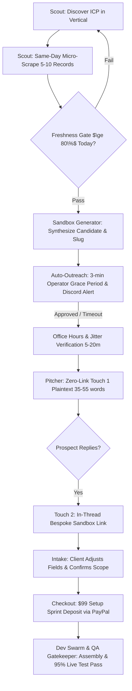

# Customer Acquisition Skill: The $99 Setup Sprint Engine

This skill governs the complete lifecycle of finding, qualifying, pitching, and converting high-intent B2B clients who rely on municipal and county public-record filings. It translates the LeadOps swarm directives into an autonomous, lights-out customer acquisition machine.

---

## 🧭 Core Directives & Acquisition Philosophy

Customer acquisition in LeadOps operates under four non-negotiable rules:

1. **Real Data Over Promises:** Never pitch a prospect with hypothetical capabilities or mocked data. Outbound outreach is unlocked **only** after the Scout engine performs a verified micro-scrape pulling 5–10 real, same-day filings from the prospect's exact target county or municipal portal.
2. **Zero-Link Touch 1 (The Deliverability Rule):** The initial cold email must be 100% plaintext, strictly between 35–55 words, with zero URLs, zero anchor links, zero tracking pixels, and zero attachments. You ask permission first.
3. **Instant Handoff (Touch 2):** When the prospect replies expressing interest, deliver their private, pre-populated bespoke sandbox URL (`portal.leadops.io/p/{slug}`) in-thread within minutes.
4. **Frictionless Onboarding via the $99 Setup Sprint:** Prospects never sit on discovery calls or fill out multi-page onboarding questionnaires. They inspect their live county filings in a bespoke sandbox, confirm field assumptions, and deploy via a **$99 Setup Sprint Deposit (100% Credited to Month 1)** backed by a **$\ge 95\%$ Live QA Gate**.



---

## 🎯 Stage 1: ICP Identification & Vertical Targeting

High-intent targets are businesses whose core revenue depends on daily or weekly public-record filings where manual docket pulling creates latency, data entry overhead, or missed deals.

### Primary Verticals & Use Cases

| Vertical | Target Organizations | Source Portals | High-Value Fields |
| :--- | :--- | :--- | :--- |
| **Probate & Estate Administration** | Probate litigation attorneys, estate liquidators, specialized real estate investors | County Probate Courts, Surrogate Courts, Register of Wills | Deceased Name, Case #, Filing Date, PR/Executor Name, Attorney of Record, Estate Estimated Value |
| **Tax Delinquencies & Liens** | Tax lien buyers, distressed property funds, redemption investors | County Treasurer / Tax Collector, Chancery Court | Parcel ID / APN, Owner Name, Delinquent Amount, Property Address, Tax Year |
| **Code Violations & Permits** | Commercial contractors, remediation specialists, wholesaling networks | Municipal Code Enforcement, City Open Data, Building Inspection Portals | Violation Code, Property Address, Hearing Date, Inspector Notes, Remediation Deadline |
| **Mechanic's Liens & Lis Pendens** | Construction litigation firms, material suppliers, mezzanine lenders | County Clerk & Recorder, Registry of Deeds | Claimant Name, Debtor Name, Amount Claimed, Real Property Description, Lien Release Date |
| **Commercial Evictions & Foreclosures** | Property managers, distressed asset brokers, debt collection attorneys | Municipal & Civil Courts, Sheriff Sale Listings | Plaintiff, Defendant, Case Number, Writ Status, Property Address, Auction Date |

### Prospect Discovery Modules
* `agents/sos_entity_prospector.py`: Queries Secretary of State business registries for active entities registered under target SIC/NAICS codes within a target state.
* `agents/state_bar_prospector.py`: Scrapes and verifies certified legal specialists (e.g., Probate, Estate Planning, Real Estate Litigation) from state bar directories.
* `agents/local_business_prospector.py`: Identifies local boutique firms and operators managing high transaction volumes in target counties.

---

## ⚡ Stage 2: The Same-Day Micro-Scrape Gate

Before an outbound draft can even be generated, the Scout agent must prove pipeline viability against the target portal.

### Execution Criteria
1. **10-Second Micro-Scrape:** Pull 5–10 real docket entries directly from the target court or county portal using `agents/county_filing_extractor.py` or configured catalog scrapers in `agents/scraper_catalog.py`.
2. **Same-Day Freshness Gate:** At least **$\ge 80\%$** of the scraped records must have an official filing date matching `current_date` (or the previous business day if running prior to 08:00 AM local time).
3. **Zero Stale Data:** If candidate cache in the database exceeds 24 hours without a fresh verification pull, automatically discard cache and re-scrape.
4. **Citation Integrity:** Every candidate record must store observed, verified source URLs. Hallucinated or mocked portal URLs are strictly rejected by the domain validator.

---

## 🛠️ Stage 3: Bespoke Sandbox Generation

Once 5–10 live records pass the freshness gate, the system provisions an unauthenticated bespoke preview environment.

1. **Unique Slug Formulation:** Generate an unguessable, human-readable slug based on company name and jurisdiction:
   `portal.leadops.io/p/{company-slug}-{jurisdiction-hash}`
2. **Confirmation Over Interrogation:**
   * Pre-fill Scout's researched target portal, filing type, and identified fields.
   * Render explicit confidence scores ($\ge 90\%$) for each detected attribute.
   * Do not force the prospect to create an account or answer discovery questionnaires.
3. **Live Data Preview:** Embed the 5–10 real records pulled during the micro-scrape directly into the sandbox view so the prospect immediately sees today's actual filings for their jurisdiction.

---

## ✉️ Stage 4: Outbound Outreach & Deliverability Protection

Outreach is handled by the **Pitcher** agent operating under the external persona of **Alex**.

### 1. Zero-Link Touch 1 Deliverability Standard
* **Format:** Strictly 100% plaintext (`text/plain`).
* **Word Count:** 35–55 words maximum.
* **Prohibitions:** NO URLs, NO hyperlinked text, NO images, NO tracking pixels, NO attachments.
* **The Permission-First Hook:** Inform the prospect that today's filings from their specific local court/county portal were pulled cleanly into a spreadsheet; ask permission to send the link.

#### Approved Touch 1 Template Structure
```text
Subject: quick question regarding [clean_county] filings

Hi [First Name],

I was reviewing the [Court/County Name] dockets this morning and pulled today's [probate/lien/permit] filings into a clean spreadsheet for our team. 

Mind if I send over the link in case it saves your staff a few hours of manual searching this week?

Best,
Alex
```

### 2. Natural Subject Line Generation
Peer-to-peer, lowercase, casual subjects (2–4 words) generated via `generate_natural_subject()` in `agents/pitcher.py`:
* `filings for [clean_county]`
* `[first_name] - quick question`
* `[clean_county] court records`
* `today's [niche] filings`
* *Forbidden:* "Automate your lead pipeline today!", "Special offer on data scraping", "Sample data feed for [Company]".

### 3. Anti-Spam Jitter & Local Office Hours
* **Office Hours Enforcement:** Outreach dispatches only between **8:00 AM – 5:00 PM** in the target recipient's local timezone. No evening or weekend cold outreach.
* **Randomized Jitter:** Successive outbound sends maintain a randomized 5–20 minute (300–1200s) delay to maintain natural delivery cadences and prevent IP reputation degradation.
* **Warmup Tiers:** Handled by `agents/email/warmup.py`, limiting daily sends based on inbox age:
  * Tier 1 (Days 1–7): Max 10 emails/day
  * Tier 2 (Days 8–14): Max 25 emails/day
  * Tier 3 (Days 15–30): Max 50 emails/day
  * Tier 4 (Established): Max 100 emails/day per dedicated SMTP mailbox

### 4. Operator Grace Period & Mobile Override
Governed by `agents/auto_outreach.py`:
1. When a prospect candidate passes all gates, the scheduler enters a **3-minute (180s) grace period**.
2. A detailed dispatch card is sent to the operator via Discord or Telegram webhook showing the prospect, scraped sample, and generated email copy.
3. The operator can 1-tap `[🛑 Reject / Cancel]` or `[⚡ Send Immediately]`.
4. If untouched after 3 minutes, the scheduler verifies office hours and sends via native Gmail SMTP or SendPulse.

---

## 💬 Stage 5: Inbound Reply Handling & Touch 2 Delivery

When an inbound reply arrives, the system categorizes it and executes the appropriate protocol.

### Inbound Reply Matrix

| Prospect Reply Type | Swarm Action | Inbound Copy Protocol |
| :--- | :--- | :--- |
| **Affirmative Permission** ("Sure, send it over", "Yes please", "What is this?") | Instant Touch 2 Handoff | Reply directly in-thread with the bespoke sandbox URL. Keep it under 40 words. |
| **Pricing / Cost Inquiry** | Commercial Boundary Clarification | Explain the $99 Setup Sprint (100% credited to Month 1) and ongoing tier pricing. |
| **Skepticism / Technical Proof** | Live Verification Reassurance | Highlight that data is pulled directly from the official municipal portal every morning at 06:00 UTC. |
| **Not Interested / Unsubscribe** | Immediate Blacklist Advance | Mark lead `State.REJECTED` or `State.OPT_OUT` immediately. Zero follow-up. |

#### Approved Touch 2 Link Delivery Template
```text
Hi [First Name],

Here is the private preview link with today's live filings from [Portal Name]:
https://portal.leadops.io/p/[slug]

You can view the extracted records and check the fields we mapped. If it fits what you need, you can lock in a daily 6:00 AM delivery to Google Sheets or webhook.

Best,
Alex
```

---

## 💰 Stage 6: The $99 Setup Sprint Protocol

The transition from prospect to paid client is completely frictionless:

1. **No Discovery Calls:** The prospect configures and verifies their pipeline inside the unauthenticated sandbox.
2. **Tier & Scope Alignment:**
   * **Starter Docket Feed:** $150/mo. Weekly extraction, up to 2,000 filings/mo, max 15 fields. Direct Google Sheets sync.
   * **Production Feed (Flagship):** $250/mo. Daily 06:00 UTC extraction, up to 15,000 filings/mo, max 20 fields. Sheets + Webhook + REST API, autonomous AST self-healing, anti-bot bypass.
   * **Enterprise Swarm:** $590/mo. Continuous/hourly multi-jurisdiction sync, unlimited filings, max 50 fields. AI OCR on PDFs, dedicated residential IP pool, direct Postgres/Snowflake sync.
3. **The $99 Deposit Rule:**
   * Flat **$99 Setup Sprint Deposit** collected upfront.
   * **100% credited** toward Month 1 retainer.
   * Never use the term "escrow" — frame as standard SaaS sprint verification.
4. **Server-Side Order Generation:**
   * Handled by `/api/portal/order` emitting a server-side PayPal order for exactly $99.00.
   * State transitions strictly via authenticated `deposit.paid` webhook; client-side confirmations cannot mark a lead paid.

---

## 🚢 Stage 7: Transition to Dev Swarm & Milestone Verification

1. **Webhook Ingestion:** Upon receiving `deposit.paid`, the lead transitions from `RESERVED` to `ACTIVE_BUILD`.
2. **Builder Swarm Activation:** Dev Lead, Systems Architect, Frontend DOM Specialist, and Network Engineer assemble and containerize the bespoke extraction pipeline.
3. **The 95% QA Hard Gate:**
   * Pipeline is executed inside an isolated Docker sandbox against live portal queries.
   * QA Gatekeeper evaluates schema completeness, type integrity, and date freshness.
   * **$\ge 95.0\%$ schema pass rate** is required to pass. Any run $<95\%$ triggers an automated replan loop.
4. **Milestone Balance Activation:**
   * QA Gatekeeper generates a 5–10 row verified live test dataset.
   * Customer portal unlocks verification review.
   * Client approval triggers remaining Month 1 balance billing ($51 for Starter, $151 for Production, $491 for Enterprise) and activates daily 06:00 UTC delivery.

---

## 📊 Stage 8: Acquisition Telemetry, KPIs & Runbook

### Key Operational Benchmarks

| Metric | Target SLA | Warning Threshold | Remediation Action |
| :--- | :--- | :--- | :--- |
| **Email Delivery / Bounce Rate** | $>98\%$ delivered | $>2\%$ bounce rate | Run `DeliverabilityVerifier`, purge invalid domains, verify MX records. |
| **Touch 1 Reply Rate** | $>15\%$ reply | $<8\%$ reply | Rotate subject line variations, check spam score, verify same-day relevance. |
| **Touch 2 Sandbox Click Rate** | $>50\%$ click-through | $<30\%$ click-through | Simplify Touch 2 copy, ensure slug loads in $<2$ seconds. |
| **Sandbox to Deposit Conversion** | $>20\%$ deposit | $<10\%$ deposit | Review confidence scores, check field schema alignment, audit portal responsiveness. |
| **QA First-Pass Rate** | $\ge 85\%$ first-pass | $<70\%$ first-pass | Improve DOM AST pruning and selector fallback chains in Dev Swarm. |

### Operator CLI Commands

To test and execute acquisition pipelines from the terminal:

```bash
# 1. Run live discovery and micro-scrape for a target county portal
python -m agents.scout_runner --jurisdiction "Travis County" --vertical "probate" --limit 5

# 2. Test auto-outreach scheduler in dry-run mode (triggers Discord card without email send)
python -m agents.auto_outreach --dry-run --lead-id "test-lead-123"

# 3. Verify SMTP deliverability and DKIM/SPF health
python -m agents.email.verifier --email "test@prospectcompany.com"

# 4. Check auto-outreach queue status and active grace periods
curl -X GET http://localhost:8000/api/admin/outreach/status -H "Authorization: Bearer $ADMIN_SECRET"
```

---

## 🔒 Compliance & Integrity Checklist

Before launching any customer acquisition campaign, ensure:
- [ ] No synthetic, mocked, or placeholder records exist in the prospect payload.
- [ ] Touch 1 email contains 0 links, 0 images, 0 tracking pixels, and word count is between 35 and 55.
- [ ] Target portal was scraped within the past 24 hours with $\ge 80\%$ records matching today's business date.
- [ ] Email warmup limits and 5–20 minute anti-spam jitter are actively configured.
- [ ] Customer-facing copy uses "Alex", "$99 Setup Sprint (100% Credited to Month 1)", and contains zero references to "escrow".
- [ ] PayPal order endpoint generates verified server-side orders for exactly $99.00.
