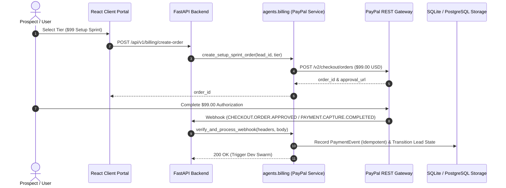

# 💳 Billing & Payment Gateway Domain (`agents/billing`)

This package governs all financial operations, order generation, subscription lifecycles, and webhook processing for the LeadOps Swarm platform. It integrates directly with the PayPal REST APIs and enforces strict idempotency and anti-tampering verification.

---

## 🏛️ Architectural Overview & Commercial Rules



### Core Invariants & Scope Boundaries:
1. **The $99 Setup Sprint Protocol**:
   - Every tier starts with an exact **$99.00 Setup Sprint Deposit**, labeled `$99 Setup Sprint Deposit (100% Credited to Month 1)`.
   - Never mark a lead as paid based on client-side frontend events; verification occurs strictly via PayPal server-side capture webhooks.
2. **Milestone Balance Unlocking**:
   - Remaining Month 1 balances ($51 Starter, $151 Production, $491 Enterprise) are billed **only after** the client reviews and approves verified records with $\ge 95\%$ QA pass.
3. **Retired Terminology**:
   - The term "escrow" is strictly prohibited. Use "100% Credited Setup Sprint" and "Live QA Verification".
4. **Idempotency & Replay Protection**:
   - Every incoming webhook payload is checked against stored transaction IDs before executing state transitions to prevent duplicate billing or duplicate swarm triggers.

---

## 📦 Package Layout

```
agents/billing/
├── __init__.py           # Re-exports public API & models
├── paypal_config.py      # PayPal credentials, sandbox/live mode, webhook ID
├── paypal_http.py        # Authenticated HTTP client with automatic OAuth token refresh
├── paypal_checkout.py    # Order creation, authorization capture, metadata binding
├── paypal_webhook.py     # PayPal webhook signature verification (CRC32/Cert validation)
├── payments.py           # Domain service coordinating payments & lead lifecycle
├── subscriptions.py      # Tier pricing definitions and milestone calculation
└── README.md             # Living architecture documentation
```

---

## 🚀 Usage Example

```python
from agents.billing import create_setup_sprint_order, verify_paypal_webhook

# 1. Create a server-side order for $99 Setup Sprint
order = await create_setup_sprint_order(
    lead_id="lead_abc123",
    tier="production",
    custom_id="lead_abc123:production"
)
print(f"PayPal Order Created: {order.order_id}")

# 2. Inbound webhook verification in FastAPI route
is_valid, event_data = await verify_paypal_webhook(
    headers=request.headers,
    raw_body=await request.body()
)
```
