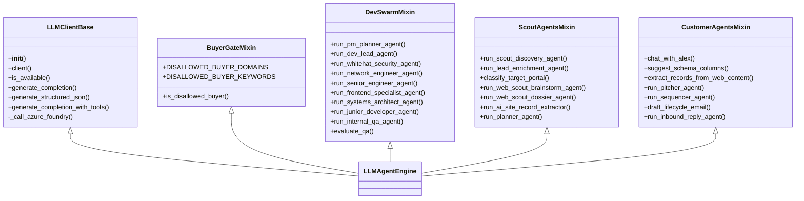

# agents.llm - Modular LLM Agent Engine Architecture

## Overview
`agents.llm` provides the core AI inference gateway and multi-agent specialist runner implementations for the LeadOps autonomous swarm, following **ADR-0002** (Strangler Fig Modularization Protocol).

Decomposed from the legacy 2,231-line `agents/llm_client.py` monolith, `agents.llm` separates concerns into focused mixins and domain modules:

## Module Structure

1. **`client.py` (`LLMClientBase`)**:
   - Provider initialization: Azure AI Foundry (`gpt-5-mini`), Groq (`llama-3.3-70b-versatile`), Nvidia NIM, Gemini, Local Ollama.
   - Core inference routines: `generate_completion`, `generate_structured_json`, `generate_completion_with_tools`.
2. **`buyer_gate.py` (`BuyerGateMixin`)**:
   - Domain and keyword blocking for government entities, municipal portals, and enterprise tech corporations.
3. **`dev_swarm.py` (`DevSwarmMixin`)**:
   - Execution loops for the 7 autonomous developer swarm roles: Dev Lead, Systems Architect, Frontend Specialist, Network Engineer, Junior Developer, Internal QA Gatekeeper.
4. **`scout_agents.py` (`ScoutAgentsMixin`)**:
   - Web discovery, portal classification, research dossier formulation, and contact research enrichment.
5. **`customer_agents.py` (`CustomerAgentsMixin`)**:
   - Cold outreach pitch generation, conversational Alex persona, intake schema suggestions, and inbound reply triage.
6. **`engine.py` (`LLMAgentEngine`)**:
   - Composes all mixins into the unified `LLMAgentEngine` class.
7. **`__init__.py` & `agents/llm_client.py`**:
   - 100% backward-compatible re-exports ensuring zero disruption to existing callers.
