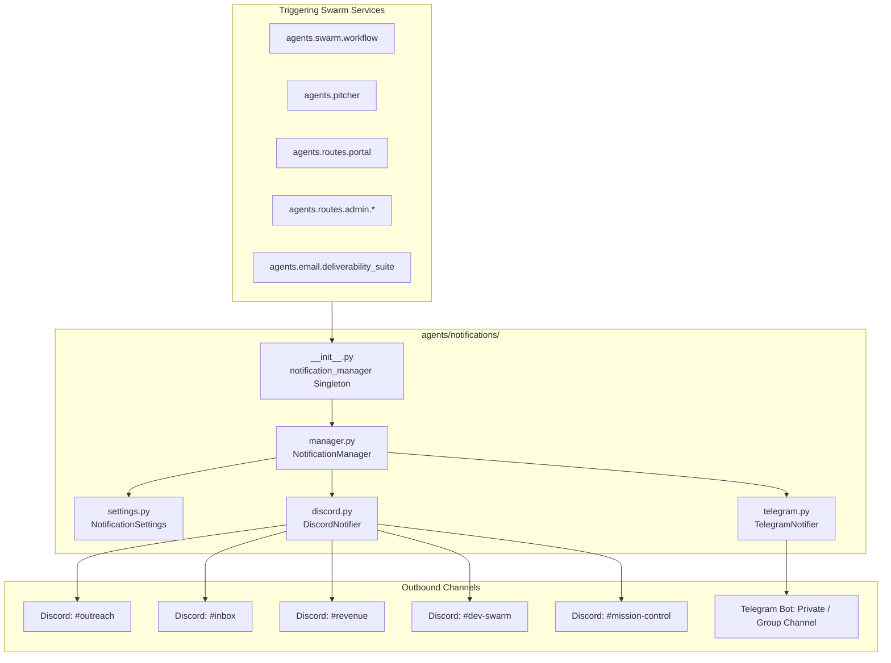

# 🔔 LeadOps Multi-Channel Notification Engine

The `agents/notifications/` package provides centralized, real-time telemetry, mission-control alerts, and operational event reporting across Discord Webhooks and Telegram Bot APIs in strict compliance with [ADR-0002](file:///c:/Users/ben/Documents/leadops2/docs/adr/ADR-0002-strangler-fig-modularization-protocol.md).

---

## 🏛️ Architecture & Routing Topology

---

## 📦 Domain Modules

| Module | Responsibility | Key Classes / Functions |
|---|---|---|
| [`settings.py`](file:///c:/Users/ben/Documents/leadops2/agents/notifications/settings.py) | Environment resolution & timeout configurations | `NotificationSettings.from_env()` |
| [`discord.py`](file:///c:/Users/ben/Documents/leadops2/agents/notifications/discord.py) | Rich embeds formatting, color palettes, and webhook POSTs | `DiscordNotifier.send_embed()` |
| [`telegram.py`](file:///c:/Users/ben/Documents/leadops2/agents/notifications/telegram.py) | HTML/Markdown chat alerts and Bot API delivery | `TelegramNotifier.send_message()` |
| [`manager.py`](file:///c:/Users/ben/Documents/leadops2/agents/notifications/manager.py) | Event payload construction, thread dispatching, and error isolation | `NotificationManager` methods |
| [`__init__.py`](file:///c:/Users/ben/Documents/leadops2/agents/notifications/__init__.py) | Backward-compatible facade and global singleton export | `notification_manager` |

---

## ⚡ Operational Rules & Safety

1. **Non-Blocking Execution**: All notifications dispatch on dedicated daemon threads (`threading.Thread(daemon=True)`) to ensure API request handlers and scraper workers are never blocked by slow webhook responses.
2. **Strict Test Environment Isolation**: When `PYTEST_CURRENT_TEST` or `MOCK_NOTIFICATIONS=true` is detected, external HTTP dispatches are safely bypassed unless `force_dispatch_in_test=True` is explicitly requested by integration fixtures.
3. **Channel-Specific Webhooks**: The manager automatically routes alerts to dedicated Discord channels (`outreach`, `inbox`, `revenue`, `dev`, `alerts`) based on event classification.
