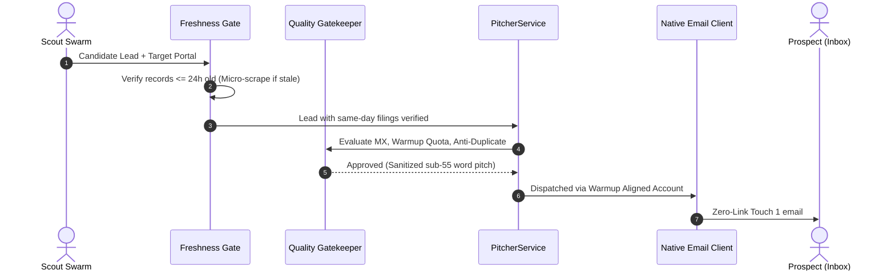

# Pitcher (Alex) Agent Module

The **Pitcher** package coordinates the outbound cold outreach and lifecycle communications for the LeadOps platform under the single human persona **Alex** (Solutions Engineer / Automation Engineering).

---

## Architectural Decomposition

Following **ADR-0002** (Strangler Fig Modularization Protocol), the monolithic `agents/pitcher.py` (1,570 LOC) has been cleanly factored into single-responsibility domain modules behind an identical, 100% backward-compatible facade (`agents/pitcher/__init__.py`):

```
agents/pitcher/
├── __init__.py           # Barrel re-export preserving identical public API
├── models.py             # PitchMessage, EmailTemplate, LIFECYCLE_EMAIL_TEMPLATES registry
├── persona.py            # Alex persona, Zero-Link Touch 1 (35-55 words), natural lowercase subjects
├── freshness.py          # Same-day freshness gate (<24h staleness check + live micro-scrape refresh)
├── service.py            # PitcherService: approvals, warmup quotas, deliverability pre-flight, dispatch
├── lifecycle.py          # Milestone notifications ($99 deposit receipt, escrow ready, LLM lifecycle engine)
└── README.md             # This living architectural specification
```

---

## Key Core Directives Enforced

1. **Zero-Link Touch 1 (Deliverability-First Rule):**
   - In `permission_first` mode, initial cold outreach contains **0 URLs, 0 links, 0 pixels**.
   - Strictly 35–55 words with a binary permission question.
2. **Same-Day Freshness Gate (`freshness.py`):**
   - Outbound dispatch is blocked if filings in candidate records are $>24$ hours old.
   - Automatically executes a live 10-second micro-scrape to inject verified same-day filings into the client's sandbox prior to email transmission.
3. **Smart Deliverability & Anti-Duplicate Shield (`service.py`):**
   - Knowlez pre-flight SMTP verification checks MX records and caches score.
   - 45-day anti-duplicate cooldown prevents emailing the same domain or entity.
   - Per-inbox jitter cooldown (5–20 minutes) prevents bulk burst throttling.
4. **$99 Setup Sprint Protocol (`lifecycle.py`):**
   - Clear receipts detailing the $99.00 deposit 100% credited to Month 1 balance.
   - QA Pass verification emails requiring $\ge 95\%$ accuracy before final Month 1 invoice ($151 net on Production).

---

## Interaction Flow


