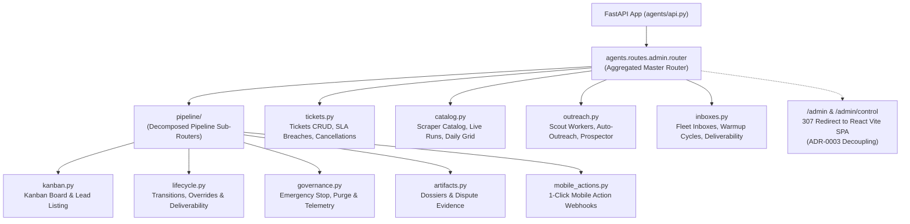

# 🎛️ Admin Mission Control Router Domain (`agents/routes/admin`)

This package provides the master administration API for the LeadOps swarm, fleet management, scraper catalog, cold outreach orchestration, and the 4-vector deliverability audit suite.

Conforms to:
- [ADR-0002: Strangler Fig De-monolithization Protocol](file:///c:/Users/ben/Documents/leadops2/docs/adr/ADR-0002-strangler-fig-modularization-protocol.md)
- [ADR-0003: Backend-Frontend Boundary Decoupling](file:///c:/Users/ben/Documents/leadops2/docs/adr/ADR-0003-backend-frontend-boundary-decoupling.md)

---

## 🏛️ Architecture & Router Topology



---

## 📦 Package Submodules

```
agents/routes/admin/
├── __init__.py          # Master router aggregating all sub-routers & ADR-0003 redirect
├── models.py            # Pydantic request models for all admin endpoints
├── pipeline/            # Decomposed Pipeline Sub-Routers:
│   ├── __init__.py      # Aggregated pipeline router
│   ├── kanban.py        # Pipeline Kanban, lead queries, deletion
│   ├── lifecycle.py     # State transitions, manual overrides, deliverability verification
│   ├── governance.py    # Emergency stop, system purge, live telemetry, daily briefing
│   ├── artifacts.py     # Client artifacts, audit trail, chargeback dispute defense dossier
│   └── mobile_actions.py # 1-click mobile operator action token approvals
├── tickets.py           # Support tickets CRUD, SLA breach detection, cancellation requests
├── catalog.py           # Scraper catalog, AST code inspection, live runs, QA overrides, daily grid
├── outreach.py          # Scout triggers, web scout, county orchestrators, prospector campaigns
├── inboxes.py           # Fleet inboxes, warmup cycles, 4-vector deliverability suite, Microsoft OAuth
└── README.md            # Living architecture documentation
```

---

## ⚠️ Core Invariants & Architectural Directives

1. **Headless REST / No Server-Rendered HTML ([ADR-0003](file:///c:/Users/ben/Documents/leadops2/docs/adr/ADR-0003-backend-frontend-boundary-decoupling.md))**:
   - In accordance with the core directive: *"do not use the backend for front end things, use the react frontend for the website"*, all admin endpoints return structured JSON or SSE streams.
   - Accessing `/admin` or `/admin/control` issues a `307 Temporary Redirect` to the React Vite SPA.
2. **Strict Admin Authentication**:
   - Endpoints require `Depends(require_admin)` enforcing valid Clerk admin credentials or Bearer token authorization.
3. **Audit Trails & Telemetry**:
   - Critical state transitions (emergency stop, purge, state overrides, QA overrides) must emit telemetry records to the audit vault.
