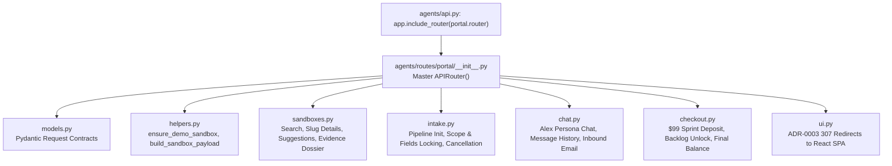

# 🌐 Portal & Client Sandbox Subsystem

The `agents/routes/portal/` package houses all client-facing endpoints for prospective buyers, unauthenticated sandboxes, $99 setup sprints, and autonomous dev swarm intake in strict compliance with [ADR-0002](file:///c:/Users/ben/Documents/leadops2/docs/adr/ADR-0002-strangler-fig-modularization-protocol.md) and [ADR-0003](file:///c:/Users/ben/Documents/leadops2/docs/adr/ADR-0003-backend-frontend-boundary-decoupling.md).

---

## 🏛️ Routing Topology

---

## 📦 Domain Sub-Routers

| Sub-Router | Responsibility | Key Endpoints |
|---|---|---|
| [`sandboxes.py`](file:///c:/Users/ben/Documents/leadops2/agents/routes/portal/sandboxes.py) | Public sandbox search, slug data resolution, column suggestions, and legal evidence dossiers | `/api/sandboxes/search` `/api/sandbox/{slug}` `/api/portal/my-lead` `/api/sandbox/{slug}/suggest-columns` `/api/sandbox/{slug}/evidence-dossier` |
| [`intake.py`](file:///c:/Users/ben/Documents/leadops2/agents/routes/portal/intake.py) | CSRF tokens, custom pipeline registration, scope locking, analytics events, and cancellation requests | `/api/csrf-token` `/api/sandbox/{slug}/fields` `/api/sandbox/{slug}/scope` `/api/pipeline/initialize` `/api/sandbox/{slug}/cancel` |
| [`chat.py`](file:///c:/Users/ben/Documents/leadops2/agents/routes/portal/chat.py) | Real-time multi-turn conversation with Alex AI persona, message history, and inbound webhook processing | `/api/sandbox/{slug}/chat` `/api/chat` `/api/email/inbound` |
| [`checkout.py`](file:///c:/Users/ben/Documents/leadops2/agents/routes/portal/checkout.py) | PayPal order generation, $99 setup sprint deposit, 30-day historical backlog unlocking, and final milestone balance payments | `/api/sandbox/{slug}/checkout` `/api/sandbox/{slug}/unlock-backlog` `/api/sandbox/{slug}/pay-deposit` `/api/sandbox/{slug}/final-checkout` `/api/sandbox/{slug}/pay-final` |
| [`ui.py`](file:///c:/Users/ben/Documents/leadops2/agents/routes/portal/ui.py) | ADR-0003 presentation boundary issuing 307 redirects to React SPA with offline development fallback | `/`, `/p/{slug}`, `/operator`, `/terms`, `/privacy`, `/get-started`, `/build` |
| [`helpers.py`](file:///c:/Users/ben/Documents/leadops2/agents/routes/portal/helpers.py) | Zero-mock data harvesting from customer target URLs, sample generation, and payload construction | `ensure_demo_sandbox` `build_sandbox_payload` `scrape_live_sample_records_for_target` |
| [`models.py`](file:///c:/Users/ben/Documents/leadops2/agents/routes/portal/models.py) | Central Pydantic request models shared across portal sub-routers | `SelectFieldsRequest` `ChatMessageRequest` `PipelineInitializeRequest` |

---

## ⚡ Operational Guidelines & Standards

1. **Zero Mock Data Policy (ADR-0001)**: Every sandbox is pre-populated with live, sourced public records. If target portal records are not yet cached, `helpers.py` immediately harvests real records from the web or vertical registry.
2. **Backend-Frontend Decoupling (ADR-0003)**: Server-side HTML rendering in `ui.py` is reserved exclusively as a headless fallback; all interactive operations are handled by the React Vite Single Page App.
3. **Audit Vault Integration**: Every terms acceptance, deposit order, backlog purchase, and final payment is logged to the immutable `audit_vault` alongside client IP, user agent, and timestamp.
