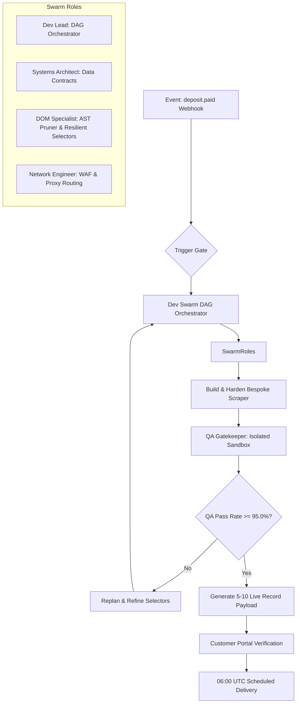

# 🐝 Autonomous Swarm & Extraction DAG (`agents/swarm`)

This package coordinates the LeadOps Dev Swarm, containerized extraction pipelines, autonomous AST self-healing, and ephemeral worker execution. It ensures reliable, zero-idle automated extractions and guarantees delivery across Google Sheets, webhooks, and REST endpoints before 08:00 AM local time.

---

## 🏛️ Architecture & Swarm DAG Flow



### Core Invariants & Operational Rules:
1. **Trigger Gate**: Execution of pipeline assembly is strictly blocked until a verified `deposit.paid` webhook arrives from PayPal.
2. **DOM Pruning Constraint**: Raw HTML must be pruned to its semantic / A11y tree before LLM analysis; context must never exceed 4,000 tokens.
3. **The 95% Hard Gate**: Pipeline evaluations in isolated sandboxes must achieve $\ge 95.0\%$ schema pass rate across extracted records. Any run scoring $<95\%$ is rejected and returned for AST self-healing.
4. **Zero-Idle Cloud Compute**: Headless scrapers run as ephemeral jobs that scale to zero immediately after pushing data payloads.
5. **Autonomous Drift Shield**: Runs a 05:30 AM pre-check query against target municipal portals. If DOM drift is detected, the DOM Specialist automatically regenerates selectors prior to the main 06:00 UTC run.

---

## 📦 Package Layout

```
agents/swarm/
├── __init__.py           # Public exports for workflow, datasets, and catalog
├── workflow.py           # DAG state machine coordinating agent transitions
├── build_loop.py         # Autonomous builder iteration loop & AST self-healing
├── datasets.py           # Dataset schema validation, QA scoring, and verification payloads
├── delivery.py           # Ephemeral dispatch to Google Sheets, webhooks, and REST endpoints
├── drift_monitor.py      # 05:30 AM portal DOM drift pre-check daemon
├── job_runner.py         # Containerized ephemeral execution runner
├── scraper_catalog.py    # Registry of active, tested scraper implementations
└── README.md             # Living architecture documentation
```

---

## 🚀 Usage Example

```python
from agents.swarm import SwarmWorkflow, evaluate_dataset_qa

# 1. Trigger autonomous build after deposit confirmation
workflow = SwarmWorkflow(lead_id="lead_abc123")
await workflow.run_pipeline_assembly()

# 2. Evaluate QA pass gate
qa_result = evaluate_dataset_qa(
    records=extracted_records,
    expected_schema=target_schema,
    pass_threshold=0.95
)

if qa_result.passed:
    print(f"QA Passed: {qa_result.score:.2%}. Unlocking client verification.")
else:
    print(f"QA Failed: {qa_result.score:.2%}. Routing to Dev Lead for self-healing.")
```
