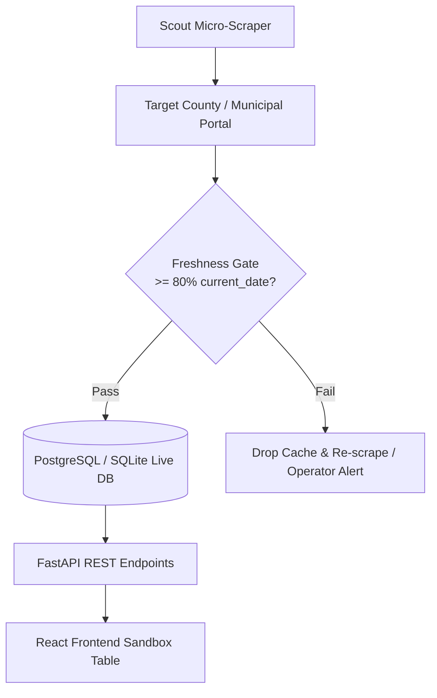

# ADR-0001: Zero-Mock Live Data Architecture

- **Status**: Accepted
- **Date**: 2026-09-16
- **Author(s)**: LeadOps Swarm Engineering
- **Deciders**: Systems Architect, Dev Lead, QA Gatekeeper
- **Related Directives**: [.agents/rules/do-not.md](file:///c:/Users/ben/Documents/leadops2/.agents/rules/do-not.md), [.agents/rules/rules.md](file:///c:/Users/ben/Documents/leadops2/.agents/rules/rules.md)

---

## 1. Context & Problem Statement

In automated lead extraction and B2B public-records systems, presenting hypothetical, simulated, or static mock data to prospects destroys trust and fails to demonstrate operational competence. Furthermore, mock data in production code masks real-world network edge cases, portal DOM drift, WAF challenges, and database race conditions.

Historically, development teams often rely on `mock_data.json` or inline dummy arrays to unblock UI development or backend prototyping. In LeadOps, this is strictly prohibited:
1. Every outbound interaction and prospect sandbox must display **5–10 real records from their specific local jurisdiction** with $\ge 80\%$ same-day freshness.
2. Production code must never contain placeholder stubs (`pass`, `TODO`, fake lead generators).

---

## 2. Decision

We mandate a strict **Zero-Mock Live Data Architecture** across all backend services, agent swarms, and the React frontend:

### Architectural Rules:
1. **Live Data Only in Production Paths**:
   - Backend APIs must never return synthetic or hardcoded prospect rows. All records must originate from live portal extraction or durable database persistence.
2. **Freshness Gate Enforcement**:
   - Scout agent micro-scrapes must pull real records where $\ge 80\%$ match `current_date` (or previous business day prior to 08:00).
   - Candidate caches older than 24 hours are automatically evicted and re-scraped.
3. **Frontend Zero-Mock Contract**:
   - React components must render live state, loading indicators, and error boundaries. Components must never fallback to hardcoded mock lists in production builds.
4. **Testing Isolation**:
   - Mock data and test fixtures are permitted exclusively within isolated test suites (`tests/`, `tests_e2e/`), never bundled into application runtimes.

---

## 3. Consequences

### Positive:
- **Instant Commercial Trust**: Prospects verify that records correspond to filings registered in their municipal courts *today*.
- **Autonomous Drift Detection**: System immediately detects court website changes, DOM alterations, or WAF blocks rather than hiding behind stale mocks.
- **Production Resilience**: Error boundaries, retries, and rate limits are tested against genuine network conditions.

### Negative / Trade-offs:
- **External Dependency**: Developing or verifying features requires active network access or pre-recorded regression recordings.
- **Strict Error Handling Needed**: Every component must handle partial portal outages, rate limits, and network latency gracefully.

---

## 4. Alternatives Considered

| Option | Pros | Cons | Reason Rejected |
| :--- | :--- | :--- | :--- |
| **Option A: Synthetic Mock Data** | Easy local prototyping, fast test runs | Zero real-world credibility; masks scraper failures and schema drift | Violates core LeadOps directive; unacceptable for customer conversion. |
| **Option B: Stale Seed Data (Weekly Dump)** | Reliable static database | Filings are out of date; fails the same-day freshness test | Prospects ignore filings that are days or weeks old. |
| **Option C: Zero-Mock Live Data (Chosen)** | 100% genuine data, high conversion, hardened error boundaries | Requires resilient scraper fallbacks and network management | **Accepted**. Directly aligns with business model and operational rules. |

---

## 5. Verification & Telemetry

1. **Scout Freshness Gate**: Enforced programmatically in `agents/scout/` and `agents/scout_runner.py`.
2. **Automated Production Ready Check**: The `automated-production-ready-check` skill runs periodic zero-mock scans across `agents/` and `frontend/src/` to ensure no mock fixtures have leaked into production source files.
