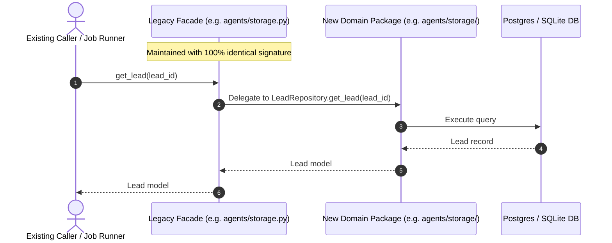

# ADR-0002: Strangler Fig De-monolithization Protocol

- **Status**: Accepted
- **Date**: 2026-09-16
- **Author(s)**: LeadOps Swarm Engineering
- **Deciders**: Systems Architect, Dev Lead
- **Related Skill**: [.agents/skills/code-organization-modularization-refactor/SKILL.md](file:///c:/Users/ben/Documents/leadops2/.agents/skills/code-organization-modularization-refactor/SKILL.md)

---

## 1. Context & Problem Statement

As the LeadOps platform grew, critical components accumulated massive complexity into single files:
- [agents/storage.py](file:///c:/Users/ben/Documents/leadops2/agents/storage.py) reached **3,006 lines** of code.
- [agents/routes/admin.py](file:///c:/Users/ben/Documents/leadops2/agents/routes/admin.py) reached **3,012 lines**.
- [frontend/src/pages/AdminPage.jsx](file:///c:/Users/ben/Documents/leadops2/frontend/src/pages/AdminPage.jsx) reached **3,153 lines**.
- [frontend/src/services/api.js](file:///c:/Users/ben/Documents/leadops2/frontend/src/services/api.js) reached **1,102 lines**.

Attempting a "big-bang" rewrite of these modules would introduce high operational risk: breaking active background workers, crashing customer sandboxes, or causing regression failures in billing webhooks.

---

## 2. Decision

We adopt the **Strangler Fig Pattern with Backward-Compatible Facades** as our mandatory protocol for modularizing and decomposing all monolithic files across Python and React codebases.

### Protocol Requirements:
1. **Zero Breaking Changes**:
   - The legacy file path (e.g., `agents/storage.py`) must remain present during migration as a thin facade.
   - All legacy imports (e.g., `from agents.storage import StorageBackend, SQLiteStorage`) must continue resolving without error.
2. **Cohesive Domain Sub-packages**:
   - Decomposed logic is organized into focused sub-packages:
     - `agents/storage/`: `connection.py`, `leads.py`, `sandboxes.py`, `tickets.py`, `events.py`.
     - `agents/routes/admin/`: `tickets.py`, `fleet.py`, `catalog.py`, `overrides.py`.
     - `frontend/src/features/`: `sandbox/`, `admin/`, `billing/`.
3. **Strict Encapsulation via `__all__`**:
   - Each new package `__init__.py` must explicitly define `__all__` to publish its public API and hide internal implementation details.
4. **Deprecation Path**:
   - Facades provide `@deprecated` docstrings directing developers to import from the new domain package.
   - Once all codebase callers are verified to import directly from the new package, the facade is trimmed or archived.

---

## 3. Consequences

### Positive:
- **Zero Downtime / Zero Regressions**: Callers continue working uninterrupted while internal architecture improves.
- **Incremental Reviewability**: Changes are reviewed and tested in small, verifiable slices.
- **Enhanced Testability**: Extracted domain services can be unit-tested in isolation without instantiating entire monolithic modules.
- **Clear Code Ownership**: Domain boundaries eliminate circular imports and reduce cognitive overhead.

### Negative / Trade-offs:
- **Temporary Indirection**: During the transition period, an extra file (the facade shim) exists in the repository.
- **Discipline Required**: Developers must follow through with migrating remaining call-sites to prevent orphaned shims from lingering permanently.

---

## 4. Alternatives Considered

| Option | Pros | Cons | Reason Rejected |
| :--- | :--- | :--- | :--- |
| **Big-Bang Rewrite** | Immediate clean slate | High risk of breaking unseen background jobs, cron triggers, or edge-case routes | Incompatible with live 24/7 production operations. |
| **Leave Monolith As-Is** | No immediate effort | Accelerating technical debt, high cognitive load, frequent merge conflicts | Unsustainable as team and feature set scale. |
| **Strangler Fig Facades (Chosen)** | Safe, incremental, proven across billing and swarm modules | Requires disciplined multi-phase migration | **Accepted**. Optimal balance of safety and velocity. |

---

## 5. Verification & Telemetry

1. **Automated Test Suite**: The complete test suite (`pytest tests/ -q`) must pass before and after each extraction phase.
2. **Caller Auditing**: Grep searches (`git grep "from agents.storage import"`) track the migration of callers to the new package path over time.
