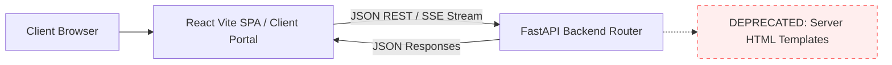

# ADR-0003: Backend-Frontend Boundary Decoupling

- **Status**: Accepted
- **Date**: 2026-09-16
- **Author(s)**: LeadOps Swarm Engineering
- **Deciders**: Systems Architect, Frontend Lead
- **Related Directives**: [.agents/rules/do-not.md](file:///c:/Users/ben/Documents/leadops2/.agents/rules/do-not.md)

---

## 1. Context & Problem Statement

Historically, several backend FastAPI routes (notably in [agents/routes/admin.py](file:///c:/Users/ben/Documents/leadops2/agents/routes/admin.py) and [agents/routes/templates.py](file:///c:/Users/ben/Documents/leadops2/agents/routes/templates.py)) returned server-rendered HTML via `HTMLResponse` (e.g. `render_admin_html`).

This pattern violates our core operational directive:
> *"do not use the backend for front end things; use the react frontend for the website"*

Server-rendering HTML from FastAPI creates severe architectural drawbacks:
1. **Duplicated UI Logic**: Admin capabilities are split between backend Jinja/HTML templates and the React Vite Admin Page (`frontend/src/pages/AdminPage.jsx`).
2. **Coupled Deployments**: UI tweaks require backend service re-deploys.
3. **Impaired User Experience**: Server-rendered HTML lacks the responsive client-side routing, optimistic UI updates, and real-time state synchronization available in React.

---

## 2. Decision

We establish a **Strict REST / React Client Boundary**:

### Architectural Rules:
1. **FastAPI Backend is Headless**:
   - Backend routes must return exclusively structured JSON (`JSONResponse`, Pydantic models), Server-Sent Events (`text/event-stream`), WebSockets, or raw file downloads (`Response(media_type="text/csv")`).
   - Returning `HTMLResponse` containing application markup or UI pages is prohibited for all new routes.
2. **React Frontend Owns All Presentation**:
   - All admin dashboards, customer sandboxes, onboarding intake flows, and billing interfaces must be rendered by the React application located in `frontend/src/`.
3. **Deprecation of Legacy HTML Templates**:
   - Existing HTML endpoints in `agents/routes/admin.py` will return JSON redirects (`307 Temporary Redirect` or redirecting directly to `/admin` in the React app) or be migrated to JSON API endpoints serving the React client.

---

## 3. Consequences

### Positive:
- **Clean Separation of Concerns**: Backend engineers focus on agent swarms, async scraping, database durability, and webhook processing; frontend engineers focus on UX, accessibility, and micro-interactions.
- **Independent Scaling & Deployments**: React SPA deploys via Azure Static Web Apps / CDN, while FastAPI deploys as an Azure Container App.
- **Superior UX**: Full access to modern React state management, toast notifications, responsive data tables, and dark-mode themes.

### Negative / Trade-offs:
- Requires ensuring CORS and Clerk authentication tokens are correctly passed on every fetch request between frontend and backend.

---

## 4. Alternatives Considered

| Option | Pros | Cons | Reason Rejected |
| :--- | :--- | :--- | :--- |
| **Server-Rendered Templates (Jinja / HTMLResponse)** | Fast single-file prototypes | Duplicated UI logic, poor client-side interactivity, violates project rules | Explicitly rejected by repository core rule. |
| **Hybrid SSR (Next.js / Remix)** | Server-side SEO | Additional Node.js runtime infrastructure required | LeadOps client portal is an authenticated B2B SaaS dashboard where client-side React SPA is the optimal fit. |
| **Headless FastAPI + React SPA (Chosen)** | Clean API contracts, decoupled deployments, rich interactive UI | Separate build pipelines | **Accepted**. Standard modern architecture adhering to all project directives. |

---

## 5. Verification & Telemetry

1. **Route Auditing**: Route definitions in `agents/routes/` are checked for `HTMLResponse`.
2. **React E2E Testing**: All user interactions verified through the React frontend test harness.
