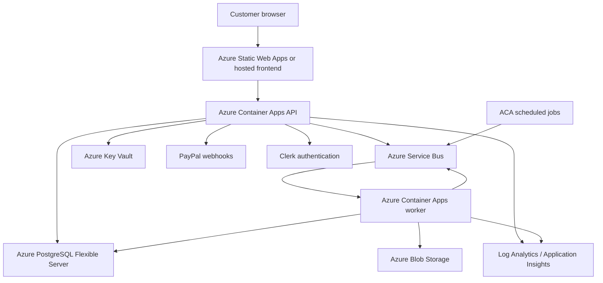

# LeadOps Azure Readiness and Operating Model

**Assessment date:** 2026-09-03  
**Purpose:** Record what LeadOps is intended to be, what is implemented, what is only designed, and the evidence required before calling it an Azure-backed business.

## 1. Product intent

LeadOps is intended to be a managed lead-data service:

1. Scout identifies a prospect and an evidence-backed source URL.
2. The prospect receives a tailored sandbox and selects the fields they need.
3. LeadOps collects an approved setup payment before development begins.
4. A build workflow creates and tests the extraction pipeline.
5. QA must pass before the final payment or escrow transition.
6. A verified payment event unlocks delivery or a buyout handoff.
7. Active customers receive scheduled data deliveries, drift monitoring, and lifecycle support.

Azure is the production operating boundary for this business, not the business itself. Azure should provide durable storage, queue-backed work execution, secrets, scheduled jobs, observability, and a public API. PayPal, Clerk, source portals, and an eventual frontend remain external product dependencies.

## 2. Current status at a glance

| Area | Status | Evidence and meaning |
|---|---|---|
| Domain rules and lifecycle | Implemented locally | `agents/domain.py`, `agents/workflow.py`, `agents/paypal_webhook.py` and the unit tests define the core behavior. |
| Local API and portal | Implemented for development | `agents/api.py` and `agents/local_portal.py` provide a runnable local service. |
| Local persistence | Implemented | `agents/storage.py` uses SQLite with WAL and idempotency records. |
| Azure architecture | Designed in code | `infra/bicep/main.bicep` and its modules define the intended resources. |
| Bicep syntax | Verified | `az bicep build --file infra/bicep/main.bicep --stdout` completed successfully. |
| Azure deployment | Unverified | No live subscription, resource group, deployment result, or endpoint verification was available during this review. |
| PostgreSQL production runtime | Incomplete | IaC creates PostgreSQL, but the application storage factory and migration flow must be proven against it. |
| Queue worker | Partially implemented | `agents/worker.py` consumes Azure Service Bus when configured, but failure, retry, settlement, and durable job state need production verification. |
| Scheduled jobs | Defined in IaC | Delivery and drift jobs are declared in `containerapps.bicep`; their environment variables, startup behavior, and successful execution are unverified. |
| Frontend hosting | Blocked | `staticwebapp.bicep` points at `my-clerk-vite-app`, but that directory is not present in this workspace. |
| Payments and auth | Implemented as adapters, not live-proven | PayPal and Clerk integration code exists, but live credentials, webhook endpoints, redirect URLs, tenancy, and replay tests remain deployment work. |
| Business launch | Not ready to claim | The product contract exists, but customer-facing production operation and evidence of live delivery do not yet. |

## 3. Intended Azure architecture

### Azure resource responsibilities

- **Container Apps API:** public HTTPS API, health endpoint, portal routes, payment/webhook routes, and customer/admin APIs.
- **Container Apps worker:** queue-driven scout, build, repair, drift, and lifecycle-email work. It must be safe to restart and safe to receive duplicate messages.
- **PostgreSQL Flexible Server:** shared durable production state. SQLite is for local development and isolated tests.
- **Service Bus:** asynchronous work boundary with retry and dead-letter behavior.
- **Blob Storage:** generated artifacts, DOM dumps, and post-mortems. Containers must remain private.
- **Key Vault:** runtime secrets accessed by managed identity. Secrets should not be passed as ordinary deployment parameters except during bootstrap.
- **Static Web Apps:** frontend hosting only after the frontend repository/path is real and its API/auth configuration is defined.
- **Log Analytics:** centralized container and scheduled-job logs. Add metrics and alert rules before launch.

## 4. What is done versus what is not done

### Done or substantially present

- Product tiers, setup deposit, final payment, QA threshold, sandbox, field selection, CSV export, and recurring delivery concepts are represented in the domain code.
- PayPal checkout metadata is separated from verified webhook state changes.
- Webhook idempotency is represented in storage and lifecycle code.
- FastAPI routes include health, portal, dashboard, admin, scout, payments, and WebSocket surfaces.
- API and worker Dockerfiles exist; the worker image installs Playwright Chromium.
- Modular Bicep covers network, PostgreSQL, storage, Service Bus, Key Vault, Container Apps, and Static Web Apps.
- Managed identity is used for Container Apps access to Key Vault and ACR.
- Service Bus queue configuration includes duplicate detection and dead lettering.
- Scheduled delivery and drift jobs are declared.

### Not done or not proven

1. **Frontend release artifact:** the Bicep frontend path references `my-clerk-vite-app`, which is absent here. Decide whether to add that frontend, point SWA at the actual frontend, or remove SWA until a frontend exists.
2. **Production storage selection:** confirm `create_storage_backend()` selects a PostgreSQL implementation when `DATABASE_URL` is present. Prove connection pooling, migrations, transactions, and concurrent writes against Azure PostgreSQL.
3. **Migration gate:** the deployment script catches unreachable migrations and still prints a successful migration banner. A deployment must fail or be explicitly marked incomplete when migrations did not run.
4. **Worker delivery semantics:** complete messages only after successful processing, preserve a retryable failure, and route terminal failures to a monitored dead-letter path. Persist job status and correlation IDs.
5. **Scheduled-job configuration:** give scheduled jobs the same database, blob, queue, and Key Vault runtime configuration as the worker, then run each job once in staging.
6. **Secret lifecycle:** use a secure bootstrap mechanism and rotate the generated admin password/API token. Do not rely on the Service Bus root manage key for application runtime if scoped sender/listener authorization can be used.
7. **Authentication and tenancy:** validate Clerk issuer/audience/claims, enforce customer-to-lead ownership, and separately enforce founder/admin roles in production.
8. **Live payment operation:** configure PayPal sandbox first, verify webhook signatures through the public API endpoint, test replay and out-of-order events, and only then switch credentials for production.
9. **Observability:** add alerts for API unhealthy state, worker crash loops, queue depth, dead-letter count, failed scheduled jobs, database failures, payment webhook failures, and storage failures.
10. **Backup and recovery:** test PostgreSQL restore, artifact retention, and a documented recovery procedure. A configured backup policy is not evidence of a tested restore.
11. **External acceptance evidence:** run staging end-to-end tests against real Azure resources and record endpoint, migration, queue, scheduled-job, payment, and restore results.

## 5. Deployment and operating process

### Phase A: local acceptance

1. Copy `.env.example` to a local ignored `.env` and provide non-production credentials.
2. Run `python -m unittest discover -s tests -v`.
3. Run the local API and `scripts/verify_live_system.py` against it.
4. Confirm payment tests use verified webhook fixtures and never mark a lead paid from checkout creation alone.

**Exit evidence:** passing tests, clean local health check, and a repeatable sandbox-to-CSV flow.

### Phase B: Azure staging

1. Choose a subscription, region, resource group, and environment name of `staging`.
2. Create or select an ACR and publish real `leadops-api` and `leadops-worker` images. Bootstrap images are not acceptable for a staging acceptance test.
3. Deploy `infra/bicep/main.bicep` with staging parameters and secrets supplied through a secure pipeline or operator session.
4. Run Alembic migrations from a network location that can reach the private PostgreSQL server, or run a migration container inside the Azure network.
5. Verify `/health`, `/readyz` if implemented, API ingress, Key Vault secret resolution, Service Bus send/receive, Blob upload, and database writes.
6. Execute one scout job, one build job, one repair or drift job, one delivery job, and one failed-job/dead-letter test.
7. Run a PayPal sandbox webhook against the deployed API and verify idempotency.
8. Run the browser acceptance test against the deployed frontend and API.

**Exit evidence:** deployment ID, image digests, migration revision, endpoint checks, queue counts before/after, scheduled-job run IDs, and test report.

### Phase C: production launch

1. Use a production resource group and production-only credentials.
2. Deploy immutable image tags or digests, never an unreviewed `latest` tag.
3. Apply database migrations as a reviewed release step before routing customer traffic.
4. Configure the real frontend origin in API CORS and verify Clerk redirect/origin settings.
5. Configure PayPal production webhooks and verify the endpoint before accepting customers.
6. Enable alerts and on-call ownership before opening checkout.
7. Start with one pilot customer and manually inspect the first delivery and post-mortem.
8. Expand only after the pilot passes delivery, billing, recovery, and restore checks.

## 6. Release gates

A release is **not production-ready** until all of these are true:

- The frontend path resolves to a real build and the deployed UI can authenticate and call the API.
- API and worker images are built from this repository and identified by immutable digests.
- PostgreSQL migrations have run successfully and the application writes to PostgreSQL, not local SQLite.
- API health and readiness checks pass from outside the private network.
- A queue message completes successfully, a transient failure retries, and a terminal failure is visible in dead letters.
- Delivery and drift scheduled jobs each complete once in staging.
- Key Vault access works through managed identity and no production secret is committed or printed.
- Clerk authorization prevents cross-customer access and protects admin routes.
- PayPal webhook signatures, replay, duplicate, and out-of-order event behavior pass tests.
- Alerts, backups, restore evidence, and an incident owner exist.

Current gate decision: **NO-GO for production; CONDITIONAL GO for continued local development and Azure staging preparation.**

## 7. Live Azure verification record

The Azure for Students subscription is authenticated and currently selected:

- Subscription: `Azure for Students` (`52efa1e6-344c-46e1-bd00-3a15f0f07683`)
- Resource group: `rg-omnileadfeeder-production`
- Region: `centralus`

Resources observed on 2026-09-03:

- API Container App: provisioning `Succeeded`, runtime `Running`, image `cromnilead1110.azurecr.io/leadops-api:latest`, target port `8000`.
- Worker Container App: provisioning `Succeeded`, runtime `Running`, scale range `0-10`, Service Bus rule configured for `leadops-jobs`.
- PostgreSQL Flexible Server: `Ready`, PostgreSQL 15, `Standard_B1ms`, public network access disabled.
- Service Bus namespace: `Active`, Standard tier.
- Storage account, Key Vault, managed identity, VNet, private DNS, Log Analytics, scheduled jobs, ACR, and Static Web App all exist.
- Static Web App hostname: `jolly-plant-0bcf0ab10.6.azurestaticapps.net`; repository URL and branch are unset.

Observed release failure:

- `GET https://aca-leadops-api-production.delightfulbay-8f60d181.centralus.azurecontainerapps.io/health` timed out externally.
- Container logs show the internal health probe reaches the process but receives `404` for `/health`.
- The current repository source does define `/health`; therefore the deployed `latest` image is stale or was built from a different source revision.
- An Azure Container Registry build was attempted with immutable tag `20260903-health-fix`, but the Azure for Students subscription returned `TasksOperationsNotAllowed`. No replacement image was deployed.
- Docker Desktop is installed locally, but its Linux daemon was unavailable during the check. The remaining supported build path is GitHub Actions or a local Docker daemon followed by an ACR push.

The existing GitHub Actions workflow builds SHA-tagged images and updates both Container Apps, but it still requires configured Azure OIDC/service-principal secrets and does not run PostgreSQL migrations or post-deployment health checks. Do not call the current live deployment production-ready until a workflow run publishes a current image, migrations complete from inside the VNet, and `/health` returns HTTP 200.

## 8. Business operating model

The technical system supports four commercial outcomes:

- **Weekly Sync:** recurring weekly delivery with a bounded field count.
- **Daily Sync:** recurring weekday delivery with a bounded field count.
- **AI / Heavy Extraction:** higher-cost daily delivery for complex sources.
- **Full Buyout:** one-time payment followed by a controlled handoff.

The business process must keep these boundaries explicit:

- A prospect is not a customer until the required payment event is verified.
- A build is not deliverable until QA passes the documented threshold and preview-row requirement.
- Checkout creation is not payment confirmation.
- A failed scrape is an operational incident with evidence, not a silent empty delivery.
- A customer cancellation, pause, referral, or win-back state must be visible in the customer and operator records.

## 9. Source-of-truth files

- Product and local behavior: [README.md](../README.md)
- Domain lifecycle: [docs/lead-lifecycle.md](lead-lifecycle.md)
- Azure orchestration: [infra/bicep/main.bicep](../infra/bicep/main.bicep)
- Azure deployment script: [scripts/deploy_azure.ps1](../scripts/deploy_azure.ps1)
- API image: [Dockerfile](../Dockerfile)
- Worker image: [Dockerfile.worker](../Dockerfile.worker)
- API runtime: [agents/api.py](../agents/api.py)
- Worker runtime: [agents/worker.py](../agents/worker.py)
- Persistence boundary: [agents/storage.py](../agents/storage.py)
- Queue boundary: [agents/service_bus.py](../agents/service_bus.py)

This document is an operating model and readiness record, not evidence that Azure resources have already been provisioned.
